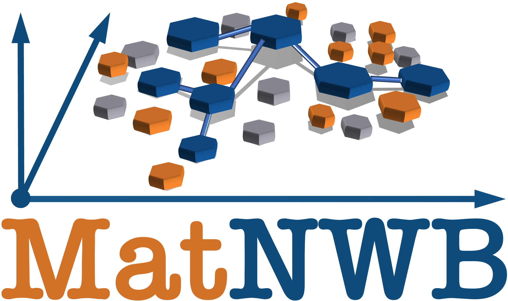

<h1 align="center">
  <br>
  <a href="https://github.com/NeurodataWithoutBorders/matnwb"></a>
</h1>

<h4 align="center">MatNWB is a  Matlab interface for reading and writing Neurodata Without Borders (NWB) 2.x files.</h4>

<h4 align="center">
  <a href="https://github.com/NeurodataWithoutBorders/matnwb/releases/latest">
    
  </a>
  <a href="https://matlab.mathworks.com/open/github/v1?repo=NeurodataWithoutBorders/matnwb&file=tutorials/basicUsage.mlx">
    
  </a>
  <a href="https://codecov.io/gh/NeurodataWithoutBorders/matnwb" >  
        
  </a>
   <a href="https://github.com/NeurodataWithoutBorders/matnwb/actions/workflows/run_tests.yml?query=event%3Apush+branch%3Amain">
   
  </a>
   <a href="https://github.com/NeurodataWithoutBorders/matnwb/actions/workflows/run_codespell.yml?query=event%3Apush+branch%3Amain">
   
  </a>
</h4>

<p align="center">
  ⚙️ <a href="#installation">Installation</a> •
  🚀 <a href="#getting-started">Getting Started</a> •
  🎓 <a href="#tutorials">Tutorials</a> •
  💡 <a href="#use-cases">Use Cases</a> •
  🤝 <a href="#contributing">Contributing</a> •
  📄 <a href="#citing-nwb">Citing NWB</a>
</p>


## Installation
Download the current release of MatNWB from the [Releases page](https://github.com/NeurodataWithoutBorders/matnwb/releases) or from [](https://www.mathworks.com/matlabcentral/fileexchange/67741-neurodatawithoutborders-matnwb). You can also check out the latest development version via 

```bash
git clone https://github.com/NeurodataWithoutBorders/matnwb.git
```
From MATLAB's command window, add MatNWB to the [search path](https://www.mathworks.com/help/matlab/matlab_env/what-is-the-matlab-search-path.html).
```matlab
addpath('path/to/matnwb');
```


## Getting Started
The MatNWB 📖 documentation can be found at https://matnwb.readthedocs.io. If you find MatNWB useful, please come back later and leave us a star ⭐

### Reading from an NWB File
If you wish to read from an NWB file, you can do so using the `nwbRead` command:
```matlab
nwbFile = nwbRead('/path/to/file.nwb');
```

The returned NwbFile object provides an in-memory view of the underlying NWB data. For more information, see the [MatNWB Documentation](https://matnwb.readthedocs.io/en/latest/pages/getting_started/file_read.html#reading-with-matnwb)

### Writing an NWB File
The building blocks of an NWB file are the neurodata types defined in the [NWB Format Specification](https://nwb-schema.readthedocs.io/en/latest/). In MatNWB, these types are autogenerated from the schema specifications and located as classes in the [`+types`](https://github.com/NeurodataWithoutBorders/matnwb/tree/main/%2Btypes) [namespace](https://www.mathworks.com/help/matlab/matlab_oop/scoping-classes-with-packages.html) of the MatNWB root directory. 

To create an NWB file, you can create neurodata objects, add them to an NwbFile object and write to disk using the `nwbExport` function (detailed examples are provided in the tutorials):
```matlab
nwbExport(nwbFile, 'path/to/file.nwb');
```

### Generate MatNWB Classes for Extensions
The `generateExtension` command generates extension classes given a file path to an extension's namespace. This can be useful if you need to work with data types from [neurodata extensions](https://nwb-extensions.github.io).

```matlab
generateExtension('some/folder/my_extension1.namespace.yaml', ...);
```

### Advanced: Generating Legacy MatNWB Classes
The `generateCore` command can generate classes for older versions of the nwb schema.

```matlab
generateCore('2.1.0'); % generates classes for NWB schema version 2.1.0
```

Supported schema versions are provided in the MatNWB root directory under [`nwb-schema`](https://github.com/NeurodataWithoutBorders/matnwb/tree/main/nwb-schema).


## Tutorials
[Intro to MatNWB](https://matnwb.readthedocs.io/en/latest/pages/tutorials/intro.html)

[Basic File Reading](https://matnwb.readthedocs.io/en/latest/pages/tutorials/read_demo.html) | a demo showcase for basic visualization from a DANDI dataset.

[Extracellular Electrophysiology](https://matnwb.readthedocs.io/en/latest/pages/tutorials/ecephys.html) | 
[▶️ in MATLAB Online](https://matlab.mathworks.com/open/github/v1?repo=NeurodataWithoutBorders/matnwb&file=tutorials/ecephys.mlx) | 
[YouTube walkthrough](https://www.youtube.com/watch?v=W8t4_quIl1k&ab_channel=NeurodataWithoutBorders)

[Calcium Imaging](https://matnwb.readthedocs.io/en/latest/pages/tutorials/ophys.html) | 
<a href="https://matlab.mathworks.com/open/github/v1?repo=NeurodataWithoutBorders/matnwb&file=tutorials/ophys.mlx" target="_blank">▶️ in MATLAB Online</a> | 
[YouTube walkthrough](https://www.youtube.com/watch?v=OBidHdocnTc&ab_channel=NeurodataWithoutBorders)

[Intracellular Electrophysiology](https://matnwb.readthedocs.io/en/latest/pages/tutorials/icephys.html)

[Behavior](https://matnwb.readthedocs.io/en/latest/pages/tutorials/behavior.html)

[Optogenetics](https://matnwb.readthedocs.io/en/latest/pages/tutorials/ogen.html)

[Dynamic tables](https://matnwb.readthedocs.io/en/latest/pages/tutorials/dynamic_tables.html)

[Images](https://matnwb.readthedocs.io/en/latest/pages/tutorials/images.html)

[Advanced data write](https://matnwb.readthedocs.io/en/latest/pages/tutorials/dataPipe.html)  | [YouTube walkthrough](https://www.youtube.com/watch?v=PIE_F4iVv98&ab_channel=NeurodataWithoutBorders)

[Using Dynamically Loaded Filters](https://matnwb.readthedocs.io/en/latest/pages/tutorials/dynamically_loaded_filters.html)

[Remote read](https://matnwb.readthedocs.io/en/latest/pages/tutorials/remote_read.html)

[Scratch Space](https://matnwb.readthedocs.io/en/latest/pages/tutorials/scratch.html)


## Use Cases
[Basic Data Retrieval](https://matnwb.readthedocs.io/en/latest/pages/tutorials/basicUsage.html)
| showcases how one would read and process converted NWB file data to display a raster diagram.

[Conversion of Real Electrophysiology/Optophysiology Data](https://matnwb.readthedocs.io/en/latest/pages/tutorials/convertTrials.html)
| converts Electrophysiology/Optophysiology Data recorded from:
>Li, Daie, Svoboda, Druckman (2016); Data and simulations related to: Robust neuronal dynamics in premotor cortex during motor planning. Li, Daie, Svoboda, Druckman, Nature. CRCNS.org
http://dx.doi.org/10.6080/K0RB72JW

Analysis examples will be added in the [dandi-example-live-scripts repo](https://github.com/NeurodataWithoutBorders/dandi-example-live-scripts)


## Under the Hood
NWB files are HDF5 files with data stored according to the Neurodata Without Borders (NWB) [schema](https://github.com/NeurodataWithoutBorders/nwb-schema/tree/dev/core). The schema is described in a set of YAML documents which defines the various types and their attributes.

Certain functions, like `generateCore` and `nwbRead`, automatically read these specifications and converts them to a set of MATLAB class files. These classes generally map directly to attributes and constraints of the types defined in the schema.


## Caveats
The NWB schema has regular updates and is open to addition of new types along with modification of previously defined types. As such, certain type presumptions made by MatNWB may be invalidated in the future from newer NWB schema versions. Furthermore, new types may require implementations that will be missing in MatNWB until patched in.

For those planning on using MatNWB alongside PyNWB, please keep the following in mind:
 - MatNWB is dependent on the schema, which may not necessarily correspond with your PyNWB schema version. Please consider overwriting the contents within MatNWB's **~/schema/core** directory with the generating PyNWB's **src/pynwb/data directory** and running `generateCore` to ensure compatibility between systems.
 
The `main` branch of this repository is considered perpetually unstable. If you want to stay on the safer side, please consider downloading the more stable releases from the [Releases](https://github.com/NeurodataWithoutBorders/matnwb/releases) page. Most releases will coincide with nwb-schema releases and guarantee compatibility of new features introduced with the schema release along with backwards compatibility with all previous nwb-schema releases.

This package reads and writes NWB 2.0 files and does not support older formats.


## Third-party Support
The `+contrib` folder contains tools for converting from other common data formats/specifications to NWB. Currently supported data types are TDT, MWorks, and Blackrock. We are interested in expanding this section to other data specifications and would greatly value your contribution!

## Contributing
For details on how to contribute to MatNWB, please stay tuned.

## Citing NWB
* **Manuscript:** Oliver Rübel, Andrew Tritt, Ryan Ly, Benjamin K Dichter, Satrajit Ghosh, Lawrence Niu, Pamela Baker, Ivan Soltesz, Lydia Ng, Karel Svoboda, Loren Frank, Kristofer E Bouchard. (2022). The Neurodata Without Borders ecosystem for neurophysiological data science. eLife, 11:e78362. doi: https://doi.org/10.7554/eLife.78362
* **RRID:** (MatNWB, RRID:SCR_021156)
