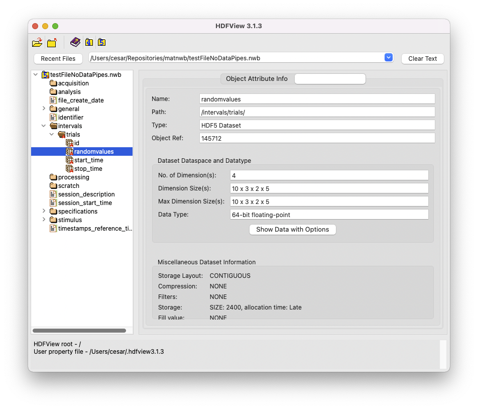

.. _dimensionMapNoDataPipes-tutorial:

Mapping Dimensions without DataPipes
====================================

.. image:: https://www.mathworks.com/images/responsive/global/open-in-matlab-online.svg
   :target: https://matlab.mathworks.com/open/github/v1?repo=NeurodataWithoutBorders/matnwb&file=tutorials/dimensionMapNoDataPipes.mlx
   :alt: Open in MATLAB Online
.. image:: https://img.shields.io/badge/View-Rendered_Live_Script-blue
   :target: ../../_static/html/tutorials/dimensionMapNoDataPipes.html
   :alt: View rendered Live Script

.. contents:: On this page
   :local:
   :depth: 2

This tutorial demonstrates how the dimensions of a MATLAB array maps onto a dataset in HDF5. There are two main differences between the way MATLAB and HDF5 represents dimensions:

1. **C-ordering vs F-ordering:** HDF5 is C-ordered, which means it stores data in a rows-first pattern, whereas MATLAB is F-ordered, storing data in the reverse pattern, with the last dimension of the array stored consecutively. The result is that the data in HDF5 is effectively the transpose of the array in MATLAB.
2. **1D data (i.e vectors):** HDF5 can store 1-D arrays, but in MATLAB the lowest dimensionality of an array is 2-D.

Due to differences in how MATLAB and HDF5 represent data, the dimensions of datasets are flipped when writing to/from file in MatNWB. Additionally, MATLAB represents 1D vectors in a 2D format, either as row vectors or column vectors, whereas HDF5 treats vectors as truly 1D. Consequently, when a 1D dataset from HDF5 is loaded into MATLAB, it is always represented as a column vector. To avoid unintentional changes in data dimensions, it is therefore recommended to avoid writing row vectors into an NWB file for 1D datasets.

Contrast this tutorial with the `dimensionMapWithDataPipes <dimensionMapWithDataPipes>`_ tutorial that illustrates how vectors are represented differently when using ``DataPipe`` objects within ``VectorData`` objects.

Create Table
------------

First, create a ``TimeIntervals`` table of height 10.

.. code-block:: matlab

   % Define VectorData objects for each column
   % 1D column
   start_col = types.hdmf_common.VectorData( ...
                   'description', 'start_times column', ...
                   'data', (1:10)' ... # maps onto HDF5 dataset of size (10,)
   );
   % 1D column
   stop_col = types.hdmf_common.VectorData( ...
                   'description', 'stop_times column', ...
                   'data', (2:11)' ... # maps onto HDF5 dataset of size (10,)
   );
   % 4D column
   randomval_col = types.hdmf_common.VectorData( ...
                   'description', 'randomvalues column', ...
                   'data', rand(5,2,3,10) ... # maps onto HDF5 dataset of size (10, 3, 2, 5)
   );
   
   % 1D column
   id_col = types.hdmf_common.ElementIdentifiers(...
                   'data', int64(0:9)'); % maps onto HDF5 dataset of size (10,)
   
   % Create table
   trials_table = types.core.TimeIntervals(...
                    'description', 'test dynamic table column',...
                   'colnames', {'start_time','stop_time','randomvalues'}, ...
                   'start_time', start_col, ...
                   'stop_time', stop_col, ...
                   'randomvalues', randomval_col, ...
                   'id', id_col ...     
   );

Export Table
------------

Create NWB file with ``TimeIntervals`` table and export.

.. code-block:: matlab

   % Create NwbFile object with required arguments
   file = NwbFile( ...
       'session_start_time', datetime('2022-01-01 00:00:00', 'TimeZone', 'local'), ...
       'identifier', 'ident1', ...
       'session_description', 'test file' ...
   );
   % Assign to intervals_trials
   file.intervals_trials = trials_table;
   % Export
   nwbExport(file, 'testFileNoDataPipes.nwb');

You can examine the dimensions of the datasets on file using `HDFView <https://www.hdfgroup.org/downloads/hdfview/>`_. Screenshots for this file are below.

