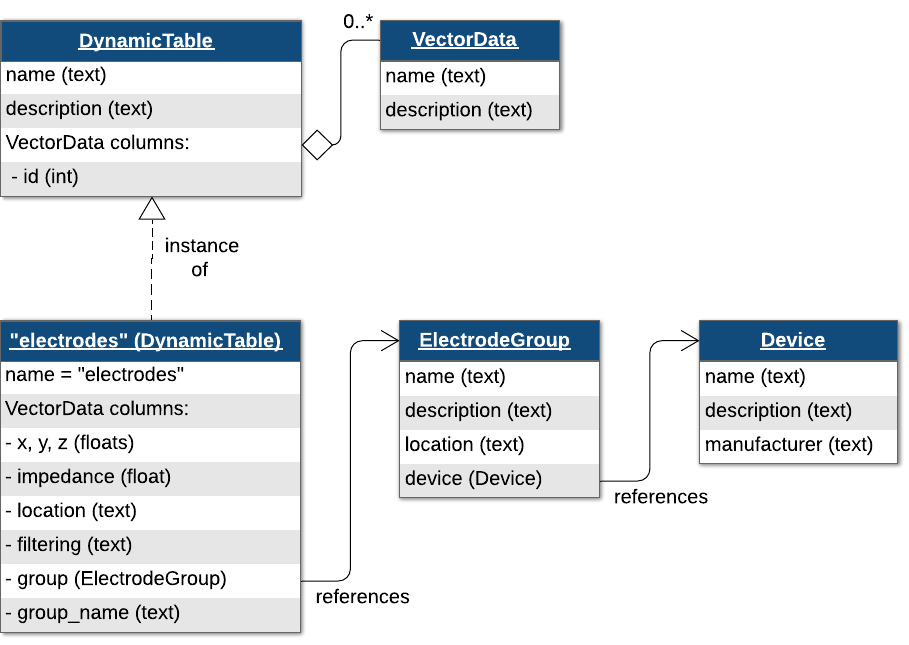
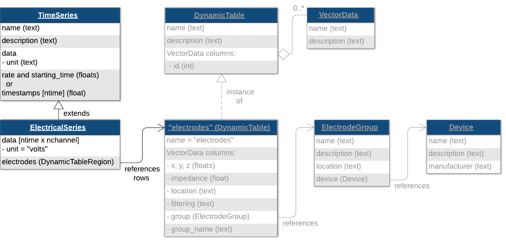
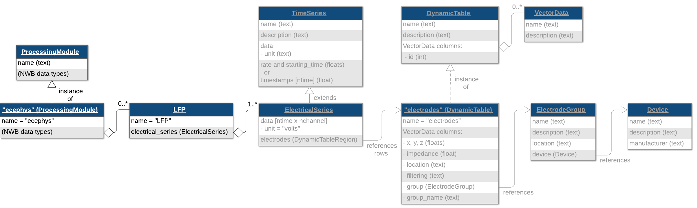
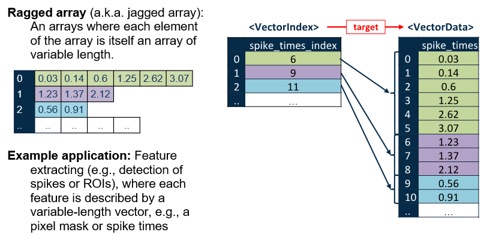

(ecephys-tutorial)=

# Extracellular Electrophysiology 🎬

```{image} https://www.mathworks.com/images/responsive/global/open-in-matlab-online.svg
:target: https://matlab.mathworks.com/open/github/v1?repo=NeurodataWithoutBorders/matnwb&file=tutorials/ecephys.mlx
:alt: Open in MATLAB Online
```
```{image} https://img.shields.io/badge/View-Rendered_Live_Script-blue
:target: ../../_static/html/tutorials/ecephys.html
:alt: View rendered Live Script
```
```{image} https://img.shields.io/badge/View-Youtube-red
:target: https://www.youtube.com/watch?v=W8t4_quIl1k&ab_channel=NeurodataWithoutBorders
:alt: View tutorial on YouTube
```


```{contents} On this page
:local:
:depth: 2
```

(ecephys-H_98dc-1)=

# About This Tutorial

This tutorial describes storage of hypothetical data from extracellular electrophysiology experiments in NWB for the following data categories:

-  Raw voltage recording 
-  Local field potential (LFP) and filtered electrical signals 
-  Spike times 
(ecephys-H_7bd1-1)=

# Before You Begin

It is recommended to first work through the [Introduction to MatNWB tutorial](intro), which demonstrates installing MatNWB and creating an NWB file with subject information, animal position, and trials, as well as writing and reading NWB files in MATLAB.


**Important**: The dimensions of timeseries data in MatNWB should be defined in the opposite order of how it is defined in the nwb\-schemas. In NWB, time is always stored in the first dimension of the data, whereas in MatNWB time should be stored in the last dimension of the data. This is explained in more detail here: [MatNWB <\-> HDF5 Dimension Mapping](dimensionMapNoDataPipes).

(ecephys-H_6ffc-1)=

# Setting up the NWB File

An NWB file represents a single session of an experiment. Each file must have a `session_description`, `identifier`, and `session_start_time`. Create a new [**`NWBFile`**](https://matnwb.readthedocs.io/en/latest/pages/functions/NwbFile.html) object these required fields along with any additional metadata. In MatNWB, arguments are specified using MATLAB's keyword argument pair convention, where each argument name is followed by its value.

```matlab
nwb = NwbFile( ...
    'session_description', 'mouse in open exploration',...
    'identifier', 'Mouse5_Day3', ...
    'session_start_time', datetime(2018, 4, 25, 2, 30, 3, 'TimeZone', 'local'), ...
    'timestamps_reference_time', datetime(2018, 4, 25, 3, 0, 45, 'TimeZone', 'local'), ...
    'general_experimenter', 'Last Name, First Name', ... % optional
    'general_session_id', 'session_1234', ... % optional
    'general_institution', 'University of My Institution', ... % optional
    'general_related_publications', {'DOI:10.1016/j.neuron.2016.12.011'}); % optional
nwb
```

```text
nwb = 
  NwbFile with properties:

                                             nwb_version: '2.9.0'
                                        file_create_date: []
                                              identifier: 'Mouse5_Day3'
                                     session_description: 'mouse in open exploration'
                                      session_start_time: {[2018-04-25T02:30:03.000000+02:00]}
                               timestamps_reference_time: {[2018-04-25T03:00:45.000000+02:00]}
                                             acquisition: [0x1 types.untyped.Set]
                                                analysis: [0x1 types.untyped.Set]
                                                 general: [0x1 types.untyped.Set]
                                 general_data_collection: ''
                                         general_devices: [0x1 types.untyped.Set]
                                  general_devices_models: [0x1 types.untyped.Set]
                          general_experiment_description: ''
                                    general_experimenter: 'Last Name, First Name'
                             general_extracellular_ephys: [0x1 types.untyped.Set]
                  general_extracellular_ephys_electrodes: []
                                     general_institution: 'University of My Institution'
                             general_intracellular_ephys: [0x1 types.untyped.Set]
     general_intracellular_ephys_experimental_conditions: []
                   general_intracellular_ephys_filtering: ''
    general_intracellular_ephys_intracellular_recordings: []
                 general_intracellular_ephys_repetitions: []
       general_intracellular_ephys_sequential_recordings: []
     general_intracellular_ephys_simultaneous_recordings: []
                 general_intracellular_ephys_sweep_table: []
                                        general_keywords: ''
                                             general_lab: ''
                                           general_notes: ''
                                    general_optogenetics: [0x1 types.untyped.Set]
                                  general_optophysiology: [0x1 types.untyped.Set]
                                    general_pharmacology: ''
                                        general_protocol: ''
                            general_related_publications: {'DOI:10.1016/j.neuron.2016.12.011'}
                                      general_session_id: 'session_1234'
                                          general_slices: ''
                                   general_source_script: ''
                         general_source_script_file_name: ''
                                        general_stimulus: ''
                                         general_subject: []
                                         general_surgery: ''
                                           general_virus: ''
                                general_was_generated_by: ''
                                               intervals: [0x1 types.untyped.Set]
                                        intervals_epochs: []
                                 intervals_invalid_times: []
                                        intervals_trials: []
                                              processing: [0x1 types.untyped.Set]
                                                 scratch: [0x1 types.untyped.Set]
                                   stimulus_presentation: [0x1 types.untyped.Set]
                                      stimulus_templates: [0x1 types.untyped.Set]
                                                   units: []

```

(ecephys-H_9e1e-1)=

## Subject Information

It is also recommended to store information about the experimental subject in the file. Create a [**`Subject`**](https://matnwb.readthedocs.io/en/latest/pages/neurodata_types/core/Subject.html) object to store metadata about the subject, then assign it to `nwb.general_subject`.

```matlab
subject = types.core.Subject( ...
    'subject_id', '005', ...
    'age', 'P90D', ...
    'description', 'mouse 5', ...
    'species', 'Mus musculus', ...
    'sex', 'M' ...
);
nwb.general_subject = subject;
```
(ecephys-H_4139-1)=

# Electrode Information

In order to store extracellular electrophysiology data, you first must create an electrodes table describing the electrodes that generated this data. Extracellular electrodes are stored in an `electrodes` table, which is also a [**`DynamicTable`**](https://matnwb.readthedocs.io/en/latest/pages/neurodata_types/hdmf_common/DynamicTable.html). `electrodes` has several required fields: `x`, `y`, `z`, `impedance`, `location`, `filtering`, and `electrode_group`.


The electrodes table references a required [**`ElectrodeGroup`**](https://matnwb.readthedocs.io/en/latest/pages/neurodata_types/core/ElectrodeGroup.html), which is used to represent a group of electrodes. Before creating an [**`ElectrodeGroup`**](https://matnwb.readthedocs.io/en/latest/pages/neurodata_types/core/ElectrodeGroup.html), you must define a [**`Device`**](https://matnwb.readthedocs.io/en/latest/pages/neurodata_types/core/Device.html) object. The fields `description`, `serial_number` and `model` are optional, but recommended. The `model` property can contain a [**`DeviceModel`**](https://matnwb.readthedocs.io/en/latest/pages/neurodata_types/core/DeviceModel.html) object which stores information about the device model. This property can be useful when searching a set of NWB files or a data archive for all files that use a specific device model (e.g., Neuropixels probe).

```matlab
device_model = types.core.DeviceModel( ...
     'manufacturer', 'Array Technologies', ...
     'model_number', 'PRB_1_4_0480_123', ...
     'description', 'Neurovoxels 0.99 - A 12-channel array with 4 shanks and 3 channels per shank' ...
);
% Add device model to nwb object
nwb.general_devices_models.set('Neurovoxels 0.99', device_model);
```
(ecephys-H_75db-1)=

```matlab

device = types.core.Device(...
    'description', 'A 12-channel array with 4 shanks and 3 channels per shank', ...
    'serial_number', '1234567890', ...
    'model', device_model ...
);

% Add device to nwb object
nwb.general_devices.set('array', device);
```
(ecephys-H_7313-1)=

## Electrodes Table

{.tutorial-media width=576px}


Since this is a [**`DynamicTable`**](https://matnwb.readthedocs.io/en/latest/pages/neurodata_types/hdmf_common/DynamicTable.html), we can add additional metadata fields. We will be adding a "label" column to the table.

```matlab
numShanks = 4;
numChannelsPerShank = 3;
numChannels = numShanks * numChannelsPerShank;

electrodesDynamicTable = types.core.ElectrodesTable(...
    'colnames', {'location', 'group', 'group_name', 'label'}, ...
    'description', 'all electrodes');

for iShank = 1:numShanks
    shankGroupName = sprintf('shank%d', iShank);
    electrodeGroup = types.core.ElectrodeGroup( ...
        'description', sprintf('electrode group for %s', shankGroupName), ...
        'location', 'brain area', ...
        'device', types.untyped.SoftLink(device) ...
    );
    
    nwb.general_extracellular_ephys.set(shankGroupName, electrodeGroup);
    for iElectrode = 1:numChannelsPerShank
        electrodesDynamicTable.addRow( ...
            'location', 'Primary visual area', ...
            'group', types.untyped.ObjectView(electrodeGroup), ...
            'group_name', shankGroupName, ...
            'label', sprintf('%s-electrode%d', shankGroupName, iElectrode));
    end
end
electrodesDynamicTable.toTable() % Display the table
```


| |id|location|group|group_name|label|
|:--:|:--:|:--:|:--:|:--:|:--:|
|1|0|'Primary visual area'|1x1 ObjectView|'shank1'|'shank1-electrode1'|
|2|1|'Primary visual area'|1x1 ObjectView|'shank1'|'shank1-electrode2'|
|3|2|'Primary visual area'|1x1 ObjectView|'shank1'|'shank1-electrode3'|
|4|3|'Primary visual area'|1x1 ObjectView|'shank2'|'shank2-electrode1'|
|5|4|'Primary visual area'|1x1 ObjectView|'shank2'|'shank2-electrode2'|
|6|5|'Primary visual area'|1x1 ObjectView|'shank2'|'shank2-electrode3'|
|7|6|'Primary visual area'|1x1 ObjectView|'shank3'|'shank3-electrode1'|
|8|7|'Primary visual area'|1x1 ObjectView|'shank3'|'shank3-electrode2'|
|9|8|'Primary visual area'|1x1 ObjectView|'shank3'|'shank3-electrode3'|
|10|9|'Primary visual area'|1x1 ObjectView|'shank4'|'shank4-electrode1'|
|11|10|'Primary visual area'|1x1 ObjectView|'shank4'|'shank4-electrode2'|
|12|11|'Primary visual area'|1x1 ObjectView|'shank4'|'shank4-electrode3'|


```matlab
nwb.general_extracellular_ephys_electrodes = electrodesDynamicTable;
```
(ecephys-H_3ff3-1)=

## Links

In the above loop, we create [**`ElectrodeGroup`**](https://matnwb.readthedocs.io/en/latest/pages/neurodata_types/core/ElectrodeGroup.html) objects. The `electrodes` table then uses an `ObjectView` in each row to link to the corresponding [**`ElectrodeGroup`**](https://matnwb.readthedocs.io/en/latest/pages/neurodata_types/core/ElectrodeGroup.html) object. An `ObjectView` is a construct that enables linking one neurodata type to another, allowing a neurodata type to reference another within the NWB file.

(ecephys-H_9bf7-1)=

# Recorded Extracellular Signals

Voltage data are stored using the [**`ElectricalSeries`**](https://matnwb.readthedocs.io/en/latest/pages/neurodata_types/core/ElectricalSeries.html) class, a subclass of the [**`TimeSeries`**](https://matnwb.readthedocs.io/en/latest/pages/neurodata_types/core/TimeSeries.html) class specialized for voltage data. 

(ecephys-H_46c1-1)=

## Referencing Electrodes

In order to create our [**`ElectricalSeries`**](https://matnwb.readthedocs.io/en/latest/pages/neurodata_types/core/ElectricalSeries.html) object, we first need to reference a set of rows in the `electrodes` table to indicate which electrode (channel) each entry in the electrical series were recorded from. We will do this by creating a [**`DynamicTableRegion`**](https://matnwb.readthedocs.io/en/latest/pages/neurodata_types/hdmf_common/DynamicTableRegion.html), which is a type of link that allows you to reference specific rows of a [**`DynamicTable`**](https://matnwb.readthedocs.io/en/latest/pages/neurodata_types/hdmf_common/DynamicTable.html), such as the `electrodes` table, using row indices.


Create a [**`DynamicTableRegion`**](https://matnwb.readthedocs.io/en/latest/pages/neurodata_types/hdmf_common/DynamicTableRegion.html) that references all rows of the `electrodes` table.

```matlab
electrode_table_region = types.hdmf_common.DynamicTableRegion( ...
    'table', types.untyped.ObjectView(electrodesDynamicTable), ...
    'description', 'all electrodes', ...
    'data', (0:length(electrodesDynamicTable.id.data)-1)');
```
(ecephys-H_7c91-1)=

## Raw Voltage Data

Now create an [**`ElectricalSeries`**](https://matnwb.readthedocs.io/en/latest/pages/neurodata_types/core/ElectricalSeries.html) object to hold acquisition data collected during the experiment.


{.tutorial-media width=840px}

```matlab
raw_electrical_series = types.core.ElectricalSeries( ...
    'starting_time', 0.0, ... % seconds
    'starting_time_rate', 30000., ... % Hz
    'data', randn(numChannels, 3000), ... % nChannels x nTime
    'electrodes', electrode_table_region, ...
    'data_unit', 'volts');
```

This is the voltage data recorded directly from our electrodes, so it goes in the acquisition group.

```matlab
nwb.acquisition.set('ElectricalSeries', raw_electrical_series);
```
(ecephys-H_861c-1)=

# Processed Extracellular Electrical Signals
(ecephys-H_378a-1)=

## LFP

LFP refers to data that has been low\-pass filtered, typically below 300 Hz. This data may also be downsampled. Because it is filtered and potentially resampled, it is categorized as processed data. LFP data would also be stored in an [**`ElectricalSeries`**](https://matnwb.readthedocs.io/en/latest/pages/neurodata_types/core/ElectricalSeries.html). To help data analysis and visualization tools know that this [**`ElectricalSeries`**](https://matnwb.readthedocs.io/en/latest/pages/neurodata_types/core/ElectricalSeries.html) object represents LFP data, we store it inside an [**`LFP`**](https://matnwb.readthedocs.io/en/latest/pages/neurodata_types/core/LFP.html) object and then place the [**`LFP`**](https://matnwb.readthedocs.io/en/latest/pages/neurodata_types/core/LFP.html) object in a [**`ProcessingModule`**](https://matnwb.readthedocs.io/en/latest/pages/neurodata_types/core/ProcessingModule.html) named `'ecephys'`. This is analogous to how we stored the [**`SpatialSeries`**](https://matnwb.readthedocs.io/en/latest/pages/neurodata_types/core/SpatialSeries.html) object inside of a [**`Position`**](https://matnwb.readthedocs.io/en/latest/pages/neurodata_types/core/Position.html) object and stored the [**`Position`**](https://matnwb.readthedocs.io/en/latest/pages/neurodata_types/core/Position.html) object in a [**`ProcessingModule`**](https://matnwb.readthedocs.io/en/latest/pages/neurodata_types/core/ProcessingModule.html) named `'behavior'` in the [behavior](behavior) tutorial


{.tutorial-media width=1311px}

```matlab
lfp_electrical_series = types.core.ElectricalSeries( ...
    'starting_time', 0.0, ... % seconds
    'starting_time_rate', 1000., ... % Hz
    'data', randn(numChannels, 100), ... nChannels x nTime
    'filtering', 'Low-pass filter at 300 Hz', ...
    'electrodes', electrode_table_region, ...
    'data_unit', 'volts');

lfp = types.core.LFP('ElectricalSeries', lfp_electrical_series);

ecephys_module = types.core.ProcessingModule(...
    'description', 'extracellular electrophysiology');

ecephys_module.nwbdatainterface.set('LFP', lfp);
nwb.processing.set('ecephys', ecephys_module);
```
(ecephys-H_9aad-1)=

## Other Types of Filtered Electrical Signals

If your acquired data is filtered for frequency ranges other than LFP—such as Gamma or Theta—you can store the result in an [**`ElectricalSeries`**](https://matnwb.readthedocs.io/en/latest/pages/neurodata_types/core/ElectricalSeries.html) and encapsulate it within a [**`FilteredEphys`**](https://matnwb.readthedocs.io/en/latest/pages/neurodata_types/core/FilteredEphys.html) object instead of the [**`LFP`**](https://matnwb.readthedocs.io/en/latest/pages/neurodata_types/core/LFP.html) object.

```matlab
% Generate filtered data
filtered_data = randn(50, 12); % 50 time points, 12 channels
filtered_data = permute(filtered_data, [2, 1]); % permute timeseries for matnwb

% Create an ElectricalSeries object
filtered_electrical_series = types.core.ElectricalSeries( ...
    'description', 'Data filtered in the theta range', ...
    'data', filtered_data, ...
    'electrodes', electrode_table_region, ...
    'filtering', 'Band-pass filtered between 4 and 8 Hz', ...
    'starting_time', 0.0, ...
    'starting_time_rate', 200.0 ...
    );

% Create a FilteredEphys object and add the filtered electrical series
filtered_ephys = types.core.FilteredEphys();
filtered_ephys.electricalseries.set('FilteredElectricalSeries', filtered_electrical_series);

% Add the FilteredEphys object to the ecephys module
ecephys_module.nwbdatainterface.set('FilteredEphys', filtered_ephys);
```
(ecephys-H_1073-1)=

## Decomposition of LFP Data into Frequency Bands

In some cases, you may want to further process the LFP data and decompose the signal into different frequency bands for additional downstream analyses. You can then store the processed data from these spectral analyses using a [**`DecompositionSeries`**](https://matnwb.readthedocs.io/en/latest/pages/neurodata_types/core/DecompositionSeries.html) object. This object allows you to include metadata about the frequency bands and metric used (e.g., `power`, `phase`, `amplitude`), as well as link the decomposed data to the original [**`TimeSeries`**](https://matnwb.readthedocs.io/en/latest/pages/neurodata_types/core/TimeSeries.html) signal the data was derived from.


In this tutorial, the examples for [**`FilteredEphys`**](https://matnwb.readthedocs.io/en/latest/pages/neurodata_types/core/FilteredEphys.html) and [**`DecompositionSeries`**](https://matnwb.readthedocs.io/en/latest/pages/neurodata_types/core/DecompositionSeries.html) may appear similar. However, the key difference is that [**`DecompositionSeries`**](https://matnwb.readthedocs.io/en/latest/pages/neurodata_types/core/DecompositionSeries.html) is specialized for storing the results of spectral analyses of timeseries data in general, whereas [**`FilteredEphys`**](https://matnwb.readthedocs.io/en/latest/pages/neurodata_types/core/FilteredEphys.html) is defined specifically as a container for filtered electrical signals.


**Note**: When adding data to a [**`DecompositionSeries`**](https://matnwb.readthedocs.io/en/latest/pages/neurodata_types/core/DecompositionSeries.html), the `data` argument is assumed to be 3D where the first dimension is time, the second dimension is channels, and the third dimension is bands. As mentioned in the beginning of this tutorial, in MatNWB the data needs to be permuted because the dimensions are written to file in reverse order (See the [dimensionMapNoDataPipes](dimensionMapNoDataPipes) tutorial)

```matlab
% Define the frequency bands of interest (in Hz):
band_names = {'theta'; 'beta'; 'gamma'};
band_mean = [8; 21; 55];
band_stdev = [2; 4.5; 12.5];
band_limits = [band_mean - 2*band_stdev, band_mean + 2*band_stdev];

% The bands should be added to the DecompositionSeries as a dynamic table
bands = table(band_names, band_mean, band_stdev, band_limits, ...
    'VariableNames', {'band_name', 'band_mean', 'band_stdev', 'band_limits'})
```


| |band_name|band_mean|band_stdev|band_limits| |
|:--:|:--:|:--:|:--:|:--:|:--:|
| | | | |1|2|
|1|'theta'|8|2|4|12|
|2|'beta'|21|4.5000|12|30|
|3|'gamma'|55|12.5000|30|80|


```matlab
bands = util.table2nwb( bands, 'Frequency bands for lfp', 'types.core.FrequencyBandsTable');

% Generate random phase data for the demonstration.
phase_data = randn(50, 12, numel(band_names)); % 50 samples, 12 channels, 3 frequency bands
phase_data = permute(phase_data, [3,2,1]); % See dimensionMapNoDataPipes tutorial

decomp_series = types.core.DecompositionSeries(...
    'data', phase_data, ...
    'bands', bands, ...
    'metric', 'phase', ...
    'starting_time', 0.0, ... % seconds
    'starting_time_rate', 1000.0, ... % Hz
    'source_channels', electrode_table_region, ...
    'source_timeseries', lfp_electrical_series);

% Add decomposition series to ecephys module
ecephys_module.nwbdatainterface.set('theta', decomp_series);
```
(ecephys-H_7ffa-1)=

# Spike Times and Extracellular Events
(ecephys-H_70ee-1)=

## Sorted Spike Times

Spike times are stored in a [**`Units`**](https://matnwb.readthedocs.io/en/latest/pages/neurodata_types/core/Units.html) table, a specialization of the [**`DynamicTable`**](https://matnwb.readthedocs.io/en/latest/pages/neurodata_types/hdmf_common/DynamicTable.html) class. The default [**`Units`**](https://matnwb.readthedocs.io/en/latest/pages/neurodata_types/core/Units.html) table is located at `/units` in the HDF5 file. You can add columns to the [**`Units`**](https://matnwb.readthedocs.io/en/latest/pages/neurodata_types/core/Units.html) table just like you did for `electrodes` and `trials` (see [convertTrials](convertTrials)). Here, we generate some random spike time data and populate the table. Note: Spike times of a [**`Units`**](https://matnwb.readthedocs.io/en/latest/pages/neurodata_types/core/Units.html) table should be sorted in ascending order.

```matlab
num_cells = 10;
spike_times = cell(1, num_cells);
for iShank = 1:num_cells
    spike_times{iShank} = sort( rand(1, randi([16, 28])), 'ascend');
end
spike_times
```


| |1|2|3|4|5|6|7|8|9|10|
|:--:|:--:|:--:|:--:|:--:|:--:|:--:|:--:|:--:|:--:|:--:|
|1|1x21 double|1x16 double|1x22 double|1x17 double|1x21 double|1x19 double|1x22 double|1x21 double|1x23 double|1x20 double|


(ecephys-H_7e54-1)=

### Ragged Arrays

Spike times are an example of a ragged array\- it's like a matrix, but each row has a different number of elements. We can represent this type of data as an indexed column of the [**`Units`**](https://matnwb.readthedocs.io/en/latest/pages/neurodata_types/core/Units.html) table. These indexed columns have two components, the [**`VectorData`**](https://matnwb.readthedocs.io/en/latest/pages/neurodata_types/hdmf_common/VectorData.html) object that holds the data and the [**`VectorIndex`**](https://matnwb.readthedocs.io/en/latest/pages/neurodata_types/hdmf_common/VectorIndex.html) object that holds the indices in the vector that indicate the row breaks. You can use the convenience function `util.create_indexed_column` to create these objects. For more information about ragged arrays, we refer you to the **"Ragged Array Columns"** section of the [dynamic table](dynamic_tables) tutorial.


{.tutorial-media width=703px}

```matlab
[spike_times_vector, spike_times_index] = util.create_indexed_column(spike_times);
spike_times_resolution = 1/20000; % If original sampling rate was 20 kHz 

nwb.units = types.core.Units( ...
    'colnames', {'spike_times'}, ...
    'description', 'units table', ...
    'spike_times', spike_times_vector, ...
    'spike_times_index', spike_times_index, ...
    'spike_times_resolution', spike_times_resolution ...
);

nwb.units.toTable()
```


| |id|spike_times|
|:--:|:--:|:--:|
|1|0|21x1 double|
|2|1|16x1 double|
|3|2|22x1 double|
|4|3|17x1 double|
|5|4|21x1 double|
|6|5|19x1 double|
|7|6|22x1 double|
|8|7|21x1 double|
|9|8|23x1 double|
|10|9|20x1 double|


(ecephys-H_44c4-1)=

## Unsorted Spike Times

While the [**`Units`**](https://matnwb.readthedocs.io/en/latest/pages/neurodata_types/core/Units.html) table is used to store spike times and waveform data for spike\-sorted, single\-unit activity, you may also want to store spike times and waveform snippets of unsorted spiking activity. This is useful for recording multi\-unit activity detected via threshold crossings during data acquisition. Such information can be stored using [**`SpikeEventSeries`**](https://matnwb.readthedocs.io/en/latest/pages/neurodata_types/core/SpikeEventSeries.html) objects.

```matlab
% In the SpikeEventSeries the dimensions should be ordered as 
% [num_events, num_channels, num_samples].
% Define spike snippets: 20 events, 3 channels, 40 samples per event. 
spike_snippets = rand(20, 3, 40);
% Permute spike snippets (See dimensionMapNoDataPipes tutorial)
spike_snippets = permute(spike_snippets, [3,2,1]) 
```

```text
spike_snippets = 
spike_snippets(:,:,1) =

    0.0448    0.4999    0.3992
    0.3081    0.4195    0.8302
    0.8547    0.8711    0.9811
    0.9839    0.5639    0.4005
    0.5730    0.7791    0.7388
    0.7184    0.9536    0.4697
    0.1436    0.5584    0.4025
    0.1082    0.0660    0.0625
    0.8346    0.9359    0.5064
    0.1359    0.7163    0.9634
    0.2006    0.1754    0.7349
    0.7141    0.0321    0.9593
    0.5382    0.9819    0.1935
    0.3039    0.3771    0.2870
    0.0842    0.6898    0.1606
    0.5091    0.8353    0.7323
    0.9263    0.1948    0.8288
    0.8448    0.2590    0.2384
    0.4333    0.0296    0.5461
    0.1969    0.5436    0.8768
    0.1082    0.0308    0.1182
    0.5142    0.9387    0.5539
    0.4602    0.2657    0.1022
    0.7343    0.2930    0.0030
    0.8397    0.3425    0.3820
    0.6551    0.4274    0.7122
    0.7352    0.0503    0.3013
    0.3563    0.4629    0.7716
    0.6722    0.1594    0.7836
    0.4933    0.5345    0.1295
    0.2220    0.9884    0.3945
    0.1030    0.7558    0.0169
    0.6515    0.3653    0.9898
    0.0747    0.9872    0.5784
    0.6783    0.0052    0.4966
    0.0529    0.1232    0.7489
    0.2175    0.2613    0.5383
    0.4077    0.6982    0.7097
    0.1306    0.4968    0.9775
    0.3144    0.4082    0.2202

spike_snippets(:,:,2) =

    0.5214    0.8168    0.0953
    0.5598    0.7712    0.8622
    0.6883    0.5980    0.2999
    0.5729    0.5391    0.6430
    0.5363    0.0980    0.9418
    0.4162    0.7752    0.1959
    0.0226    0.7248    0.4232
    0.4031    0.9283    0.1889
    0.8650    0.0110    0.2488
    0.7362    0.5752    0.6446
    0.9470    0.6151    0.2051
    0.1599    0.8298    0.3867
    0.8216    0.6022    0.4189
    0.1872    0.7790    0.7100
    0.9462    0.2746    0.0902
    0.9202    0.2957    0.2662
    0.5207    0.5176    0.5367
    0.5994    0.8800    0.3343
    0.8863    0.8539    0.5738
    0.4338    0.8518    0.3174
    0.2413    0.0356    0.6680
    0.7874    0.2089    0.8840
    0.0986    0.3145    0.6229
    0.5096    0.2391    0.2551
    0.4723    0.7274    0.8629
    0.7387    0.7167    0.0311
    0.4582    0.9406    0.7170
    0.0036    0.8680    0.7180
    0.7490    0.7569    0.3692
    0.3120    0.6861    0.9138
    0.5312    0.9394    0.9478
    0.3886    0.9523    0.3975
    0.7356    0.5279    0.0609
    0.5490    0.1377    0.5200
    0.2433    0.7877    0.9648
    0.0293    0.4077    0.9336
    0.0699    0.0871    0.3527
    0.3262    0.7260    0.0443
    0.8871    0.3961    0.6828
    0.2800    0.5372    0.6114

spike_snippets(:,:,3) =

    0.0334    0.8563    0.1431
    0.0774    0.2493    0.5754
    0.2854    0.3137    0.5419
    0.3142    0.5233    0.8181
    0.5274    0.3271    0.6378
    0.6168    0.1527    0.8685
    0.1650    0.6473    0.4884
    0.9741    0.5911    0.1309
    0.8840    0.2038    0.5337
    0.5746    0.5654    0.4889
    0.9494    0.6576    0.7162
    0.0874    0.8776    0.6100
    0.4287    0.8194    0.4749
    0.9128    0.5198    0.3950
    0.7842    0.1908    0.8119
    0.1971    0.4198    0.2779
    0.2477    0.2518    0.7464
    0.3395    0.7491    0.5936
    0.3711    0.0025    0.4033
    0.9923    0.4658    0.6963
    0.3699    0.8851    0.1982
    0.4076    0.0971    0.3556
    0.3242    0.9669    0.2393
    0.7106    0.4671    0.4623
    0.9503    0.3120    0.7041
    0.4715    0.3398    0.5858
    0.8502    0.1546    0.3234
    0.8701    0.3023    0.3031
    0.6462    0.8896    0.1886
    0.1349    0.9536    0.1926
    0.1838    0.5187    0.6160
    0.0259    0.4219    0.6956
    0.3577    0.9520    0.1043
    0.2075    0.6375    0.8224
    0.9621    0.6944    0.9799
    0.2368    0.6001    0.0381
    0.6667    0.0374    0.7605
    0.8990    0.2586    0.1942
    0.1856    0.8315    0.5214
    0.7980    0.1807    0.0440

spike_snippets(:,:,4) =

    0.0422    0.7913    0.8797
    0.3453    0.7980    0.9614
    0.7145    0.0471    0.0131
    0.7350    0.4009    0.5220
    0.7073    0.7727    0.4160
    0.2004    0.5359    0.8998
    0.9073    0.2879    0.8568
    0.8955    0.7169    0.1745
    0.5634    0.6420    0.7729
    0.5361    0.9940    0.1787
    0.6475    0.1399    0.1709
    0.1192    0.9459    0.2078
    0.9945    0.4189    0.3432
    0.2616    0.1392    0.7001
    0.2268    0.5149    0.6811
    0.7192    0.1482    0.6413
    0.4191    0.6010    0.1443
    0.2876    0.2507    0.0734
    0.0759    0.7565    0.3489
    0.3653    0.5042    0.9238
    0.1041    0.2323    0.2582
    0.8625    0.5628    0.9862
    0.4804    0.5841    0.5443
    0.4672    0.4026    0.6349
    0.5864    0.5317    0.7450
    0.5261    0.1008    0.5545
    0.1871    0.7274    0.2849
    0.0048    0.2657    0.2750
    0.9547    0.8459    0.7166
    0.9544    0.7316    0.4380
    0.3446    0.8783    0.8180
    0.2870    0.8780    0.7842
    0.4677    0.1807    0.3191
    0.5285    0.4904    0.7021
    0.5858    0.7780    0.2202
    0.7299    0.8607    0.1365
    0.9001    0.3839    0.9823
    0.4091    0.8344    0.5005
    0.2879    0.3863    0.7702
    0.6122    0.3369    0.0746

spike_snippets(:,:,5) =

    0.5077    0.7594    0.3470
    0.9934    0.4658    0.3974
    0.8013    0.4101    0.8451
    0.1950    0.1594    0.0102
    0.0064    0.3072    0.2523
    0.0413    0.7231    0.9682
    0.9851    0.2600    0.7065
    0.9963    0.7203    0.3814
    0.7554    0.4230    0.5510
    0.5954    0.1892    0.3889
    0.0383    0.7107    0.2847
    0.9964    0.3979    0.5814
    0.1587    0.8491    0.4533
    0.6707    0.6320    0.7276
    0.3761    0.9109    0.4542
    0.6746    0.1588    0.8628
    0.4027    0.0694    0.1459
    0.5055    0.1527    0.7187
    0.6772    0.2630    0.1905
    0.3273    0.9966    0.8896
    0.1760    0.0484    0.3530
    0.6857    0.1675    0.8215
    0.2560    0.1755    0.8770
    0.4476    0.9203    0.4309
    0.2614    0.2719    0.2387
    0.3506    0.9995    0.9606
    0.9491    0.1547    0.2414
    0.7983    0.2241    0.1761
    0.1524    0.3020    0.8325
    0.7604    0.3374    0.3277
    0.9833    0.2165    0.5591
    0.8982    0.1245    0.6866
    0.9882    0.1585    0.7581
    0.8570    0.5795    0.5831
    0.8974    0.2664    0.8785
    0.7286    0.0648    0.1809
    0.9960    0.7032    0.3814
    0.6474    0.5012    0.1137
    0.4660    0.9255    0.7803
    0.4970    0.4184    0.9214

spike_snippets(:,:,6) =

    0.7038    0.2115    0.8782
    0.3535    0.1083    0.8791
    0.2574    0.1252    0.3886
    0.2894    0.8596    0.9993
    0.0126    0.1899    0.4921
    0.5567    0.0855    0.7894
    0.2496    0.6602    0.0495
    0.3982    0.0580    0.4567
    0.0301    0.9578    0.7397
    0.7401    0.3808    0.6104
    0.1234    0.9752    0.1957
    0.6138    0.3585    0.1835
    0.5930    0.1411    0.0774
    0.2775    0.7655    0.0211
    0.8598    0.8152    0.5743
    0.6803    0.6063    0.4831
    0.2168    0.6321    0.9288
    0.4817    0.5441    0.3781
    0.9538    0.8823    0.7824
    0.8800    0.1891    0.5992
    0.2518    0.1524    0.3812
    0.4926    0.7388    0.8609
    0.1852    0.0474    0.8378
    0.5434    0.0301    0.9144
    0.0678    0.5215    0.1263
    0.9311    0.7068    0.9184
    0.0203    0.0634    0.8333
    0.2753    0.9403    0.6716
    0.1578    0.3279    0.9844
    0.0632    0.3105    0.7572
    0.4111    0.9222    0.2846
    0.6001    0.7409    0.8956
    0.4262    0.5295    0.6530
    0.4622    0.6070    0.4785
    0.2292    0.4604    0.2245
    0.8173    0.7424    0.8631
    0.6706    0.8498    0.9789
    0.7043    0.4692    0.5270
    0.8141    0.3917    0.3421
    0.4113    0.5746    0.6539

spike_snippets(:,:,7) =

    0.4830    0.8348    0.3303
    0.4797    0.8513    0.0365
    0.2267    0.1815    0.5210
    0.3259    0.0009    0.8033
    0.7416    0.9259    0.8932
    0.0546    0.1204    0.8003
    0.9566    0.0039    0.4733
    0.1086    0.7608    0.7297
    0.0793    0.2838    0.9477
    0.6760    0.6366    0.6520
    0.2940    0.1524    0.0849
    0.2674    0.8783    0.6969
    0.5674    0.5568    0.7976
    0.1343    0.4529    0.5897
    0.7529    0.6799    0.9093
    0.0372    0.5661    0.1820
    0.6365    0.1360    0.6515
    0.8576    0.8305    0.9199
    0.4887    0.4568    0.6526
    0.8478    0.2754    0.1170
    0.8913    0.3586    0.4876
    0.7330    0.9550    0.1696
    0.6343    0.3234    0.4609
    0.0959    0.7405    0.7331
    0.0807    0.9715    0.3040
    0.4652    0.5189    0.7586
    0.1280    0.3849    0.5309
    0.0384    0.8520    0.1617
    0.8960    0.1551    0.8112
    0.4447    0.2059    0.1929
    0.6829    0.9010    0.8107
    0.0566    0.2811    0.4061
    0.7065    0.9550    0.4079
    0.1903    0.2854    0.3732
    0.4290    0.8303    0.4752
    0.6693    0.5507    0.3658
    0.9329    0.8123    0.0812
    0.0941    0.1734    0.2639
    0.3244    0.6010    0.1235
    0.5392    0.1523    0.6165

spike_snippets(:,:,8) =

    0.7348    0.8510    0.8162
    0.5289    0.5578    0.3034
    0.2634    0.8211    0.1179
    0.6876    0.5695    0.7087
    0.4154    0.5687    0.6495
    0.4308    0.5388    0.0012
    0.7181    0.1434    0.8433
    0.9409    0.9880    0.8409
    0.5764    0.8873    0.7957
    0.8648    0.1262    0.8533
    0.6810    0.0929    0.2474
    0.2506    0.9993    0.7281
    0.2847    0.9611    0.2128
    0.0814    0.6429    0.4400
    0.3432    0.8512    0.9039
    0.8094    0.1783    0.7474
    0.2762    0.4519    0.8896
    0.3068    0.2305    0.6274
    0.1315    0.3504    0.4726
    0.6032    0.3766    0.1384
    0.7378    0.7366    0.7234
    0.0893    0.2245    0.3074
    0.9874    0.3353    0.1549
    0.0152    0.6581    0.9200
    0.6632    0.0609    0.8342
    0.5502    0.0876    0.2386
    0.6548    0.4577    0.4223
    0.2303    0.5694    0.2875
    0.2250    0.0883    0.5503
    0.7938    0.5780    0.7187
    0.1215    0.1220    0.1539
    0.6990    0.3722    0.4870
    0.2296    0.2280    0.1281
    0.0901    0.1972    0.8767
    0.9280    0.4405    0.8676
    0.9364    0.4708    0.5563
    0.5521    0.0284    0.4005
    0.3502    0.1522    0.6089
    0.7816    0.3110    0.5638
    0.1143    0.2928    0.6634

spike_snippets(:,:,9) =

    0.9355    0.2086    0.9213
    0.8630    0.8816    0.3660
    0.7107    0.0033    0.8234
    0.7651    0.8009    0.6469
    0.6414    0.2067    0.9601
    0.4239    0.7051    0.5154
    0.9322    0.7302    0.9470
    0.3800    0.3041    0.1378
    0.3567    0.0656    0.2607
    0.1328    0.7437    0.4803
    0.6443    0.2276    0.2008
    0.7494    0.1686    0.5638
    0.8927    0.8748    0.1570
    0.4349    0.8642    0.5841
    0.8029    0.7536    0.1237
    0.3324    0.7045    0.5427
    0.6977    0.2753    0.5260
    0.9838    0.0916    0.5097
    0.7819    0.6946    0.6267
    0.4574    0.0447    0.3493
    0.4812    0.8261    0.8648
    0.1385    0.2863    0.7425
    0.8314    0.4645    0.4195
    0.5932    0.6924    0.6245
    0.7775    0.2499    0.4707
    0.0067    0.9105    0.7060
    0.8708    0.1003    0.4135
    0.6396    0.0352    0.4422
    0.8584    0.1111    0.0086
    0.9119    0.8084    0.2180
    0.5056    0.6534    0.8758
    0.1380    0.9844    0.9133
    0.0798    0.8115    0.8639
    0.4122    0.4365    0.1866
    0.6165    0.0619    0.9061
    0.5898    0.4816    0.8297
    0.6914    0.6382    0.1749
    0.7054    0.4685    0.4769
    0.5408    0.2628    0.2203
    0.5168    0.9099    0.9523

spike_snippets(:,:,10) =

    0.9482    0.6699    0.0437
    0.5095    0.1619    0.1001
    0.8423    0.0489    0.8652
    0.6344    0.0397    0.5283
    0.4072    0.2007    0.6755
    0.5192    0.3678    0.2416
    0.2389    0.5926    0.8891
    0.1943    0.0727    0.9535
    0.3162    0.8434    0.9984
    0.4959    0.7843    0.5484
    0.1876    0.0886    0.2809
    0.3444    0.9132    0.0674
    0.5192    0.2879    0.3641
    0.3200    0.1680    0.2895
    0.5966    0.6610    0.0916
    0.0450    0.2162    0.4429
    0.3061    0.2472    0.4061
    0.5325    0.2262    0.6804
    0.3477    0.8628    0.0034
    0.2021    0.1178    0.0729
    0.6014    0.6625    0.5151
    0.6927    0.2442    0.8449
    0.6007    0.5533    0.6792
    0.7558    0.0441    0.0992
    0.1976    0.2167    0.2040
    0.3053    0.4671    0.1661
    0.9515    0.2755    0.8261
    0.2260    0.5179    0.5928
    0.8737    0.8319    0.1125
    0.8525    0.6294    0.6307
    0.7547    0.5012    0.2726
    0.6388    0.7237    0.5716
    0.0215    0.4514    0.0918
    0.2243    0.4261    0.4368
    0.8599    0.7638    0.6568
    0.8205    0.2091    0.5950
    0.4836    0.9358    0.4829
    0.4593    0.2993    0.6939
    0.8560    0.8870    0.3444
    0.1419    0.7681    0.2603

spike_snippets(:,:,11) =

    0.6150    0.9150    0.7227
    0.9465    0.9174    0.1427
    0.1226    0.7705    0.8381
    0.0995    0.3740    0.3562
    0.9977    0.3161    0.7896
    0.0795    0.0966    0.0017
    0.6357    0.2331    0.9441
    0.4559    0.5813    0.6801
    0.2366    0.2765    0.3204
    0.9248    0.0112    0.0127
    0.4168    0.7074    0.9545
    0.7216    0.9860    0.0539
    0.3493    0.3649    0.5586
    0.2415    0.6188    0.7910
    0.1025    0.3302    0.2752
    0.0786    0.2436    0.0861
    0.7782    0.8524    0.8267
    0.4935    0.9900    0.0790
    0.3741    0.6629    0.8160
    0.9294    0.4921    0.4946
    0.0148    0.7104    0.9352
    0.7191    0.4832    0.9880
    0.2035    0.8642    0.3446
    0.1688    0.2378    0.7459
    0.4254    0.2792    0.5608
    0.5488    0.5488    0.3630
    0.9569    0.7196    0.7215
    0.1111    0.9809    0.1002
    0.0353    0.6575    0.0409
    0.1486    0.4276    0.5512
    0.2744    0.9031    0.9802
    0.6991    0.9862    0.7186
    0.9952    0.7138    0.7252
    0.9115    0.7335    0.4245
    0.3578    0.9389    0.8819
    0.6411    0.6662    0.0529
    0.1723    0.5118    0.0805
    0.6068    0.5743    0.4254
    0.9330    0.5201    0.0124
    0.3980    0.0647    0.3434

spike_snippets(:,:,12) =

    0.9356    0.3722    0.9862
    0.9447    0.6667    0.1401
    0.7050    0.3013    0.6176
    0.6680    0.6621    0.7144
    0.4229    0.8847    0.4053
    0.8284    0.6327    0.3847
    0.6131    0.4310    0.1643
    0.1144    0.9539    0.5386
    0.2464    0.5716    0.8084
    0.2074    0.8086    0.9877
    0.7823    0.9711    0.3681
    0.7692    0.7909    0.4723
    0.2679    0.4775    0.3081
    0.9214    0.5721    0.0854
    0.7375    0.4740    0.5194
    0.6147    0.3860    0.5905
    0.8190    0.5903    0.2896
    0.7256    0.0437    0.0646
    0.1770    0.6256    0.5786
    0.0170    0.3065    0.0656
    0.2172    0.2832    0.7070
    0.8657    0.2023    0.1565
    0.2669    0.2278    0.1596
    0.2075    0.8799    0.0920
    0.6533    0.8260    0.7543
    0.2653    0.0351    0.0882
    0.5481    0.3615    0.5982
    0.0850    0.6739    0.7395
    0.3716    0.7225    0.0685
    0.7255    0.3589    0.1080
    0.1867    0.7983    0.6314
    0.7967    0.6139    0.6427
    0.4562    0.5048    0.0781
    0.0555    0.5205    0.8295
    0.5530    0.0137    0.7183
    0.8918    0.6114    0.7576
    0.3754    0.1705    0.0263
    0.2102    0.9617    0.2002
    0.3466    0.6024    0.0357
    0.3158    0.9941    0.6570

spike_snippets(:,:,13) =

    0.4878    0.0460    0.3295
    0.7019    0.0969    0.9237
    0.1553    0.6207    0.3177
    0.3395    0.3901    0.9521
    0.0973    0.7200    0.3504
    0.2732    0.5109    0.0826
    0.5862    0.4430    0.1920
    0.3447    0.9847    0.9386
    0.1506    0.6496    0.7356
    0.8166    0.9494    0.0374
    0.1123    0.3946    0.2234
    0.9939    0.8195    0.2815
    0.1284    0.3495    0.4675
    0.1828    0.1605    0.6001
    0.0130    0.0551    0.3509
    0.3996    0.8239    0.6767
    0.4010    0.5537    0.1684
    0.1839    0.9757    0.1520
    0.1309    0.4673    0.9603
    0.1838    0.2202    0.7254
    0.3725    0.5439    0.4788
    0.3240    0.3264    0.8712
    0.5533    0.5398    0.4358
    0.8961    0.2427    0.4353
    0.9494    0.3357    0.7187
    0.6217    0.1226    0.2140
    0.1143    0.3856    0.3149
    0.5670    0.8505    0.1296
    0.0371    0.6400    0.1677
    0.2077    0.9166    0.6479
    0.9438    0.1555    0.2042
    0.6470    0.2296    0.5908
    0.6534    0.6596    0.2747
    0.5037    0.1870    0.6571
    0.5497    0.0500    0.2396
    0.7608    0.9807    0.7331
    0.7824    0.6346    0.5622
    0.5358    0.9365    0.8876
    0.5417    0.6079    0.2021
    0.2871    0.6315    0.0705

spike_snippets(:,:,14) =

    0.5551    0.4644    0.4178
    0.1983    0.1660    0.7571
    0.7082    0.1199    0.9988
    0.7940    0.5774    0.7825
    0.5485    0.5258    0.3026
    0.4933    0.1806    0.5104
    0.8849    0.7695    0.4330
    0.8745    0.0890    0.4203
    0.1247    0.8747    0.7230
    0.4664    0.4630    0.1941
    0.4138    0.4429    0.7864
    0.3183    0.5627    0.8467
    0.5656    0.3798    0.5218
    0.5029    0.7866    0.4622
    0.9339    0.2489    0.6188
    0.9612    0.8258    0.7691
    0.6197    0.2043    0.4658
    0.8862    0.4024    0.5786
    0.4553    0.0880    0.9555
    0.9896    0.0327    0.7431
    0.7000    0.7152    0.3641
    0.4993    0.1507    0.7713
    0.0388    0.5235    0.1961
    0.5465    0.8286    0.9819
    0.7151    0.2216    0.7286
    0.9894    0.4516    0.2408
    0.7987    0.0928    0.1614
    0.8617    0.1665    0.7797
    0.2362    0.4621    0.6659
    0.9757    0.1535    0.9304
    0.8183    0.0734    0.5339
    0.9472    0.2323    0.7424
    0.7827    0.9086    0.9694
    0.7477    0.4471    0.3601
    0.7486    0.0818    0.9779
    0.7887    0.0800    0.6154
    0.2370    0.6921    0.4184
    0.4020    0.7340    0.7286
    0.8621    0.8580    0.7848
    0.3361    0.9863    0.3328

spike_snippets(:,:,15) =

    0.2965    0.7031    0.9050
    0.0114    0.4375    0.8359
    0.0379    0.8688    0.5790
    0.3810    0.2983    0.8708
    0.3524    0.0630    0.8158
    0.1015    0.7678    0.5271
    0.6002    0.9859    0.4074
    0.2053    0.3457    0.6340
    0.5633    0.4876    0.0744
    0.2259    0.7316    0.4407
    0.7762    0.8144    0.4036
    0.4739    0.6680    0.6574
    0.9761    0.3067    0.0529
    0.5992    0.3892    0.4717
    0.2290    0.7412    0.8737
    0.9834    0.4048    0.8238
    0.2222    0.8437    0.6088
    0.6804    0.4076    0.5012
    0.9068    0.6857    0.6989
    0.7931    0.0164    0.4235
    0.5477    0.9234    0.6329
    0.6656    0.4617    0.7028
    0.9699    0.1809    0.8603
    0.8069    0.3975    0.8928
    0.3513    0.1661    0.7521
    0.8873    0.1770    0.2451
    0.7727    0.9616    0.0837
    0.1265    0.3785    0.8309
    0.4330    0.1990    0.8397
    0.8952    0.3244    0.5113
    0.3376    0.1494    0.7938
    0.8784    0.3603    0.7812
    0.4863    0.4698    0.8547
    0.3724    0.2789    0.4052
    0.6074    0.4098    0.2649
    0.3880    0.6125    0.0381
    0.7730    0.9770    0.2335
    0.3138    0.8044    0.7232
    0.0912    0.5060    0.6443
    0.9612    0.9444    0.4424

spike_snippets(:,:,16) =

    0.8396    0.9311    0.4598
    0.9203    0.5404    0.7045
    0.8985    0.9008    0.6985
    0.2740    0.7361    0.9974
    0.2936    0.0546    0.5217
    0.3754    0.3205    0.8939
    0.5419    0.7213    0.2998
    0.0385    0.4889    0.4254
    0.5262    0.1861    0.6672
    0.0963    0.3029    0.2435
    0.4392    0.9537    0.2879
    0.2068    0.6096    0.9656
    0.0617    0.0689    0.1129
    0.4461    0.8549    0.8807
    0.6501    0.0830    0.0112
    0.3309    0.4727    0.5015
    0.2532    0.6061    0.0219
    0.1202    0.7391    0.1615
    0.3841    0.1678    0.7851
    0.2090    0.3276    0.4469
    0.9462    0.6033    0.6302
    0.0870    0.6558    0.4958
    0.2100    0.1864    0.2777
    0.4674    0.3785    0.5059
    0.4201    0.3117    0.4491
    0.8746    0.3871    0.6135
    0.7739    0.6354    0.1584
    0.7295    0.0791    0.9746
    0.9874    0.0958    0.7115
    0.0342    0.2017    0.4592
    0.8743    0.6979    0.6484
    0.7391    0.0882    0.2166
    0.8361    0.7757    0.9170
    0.5692    0.9203    0.3338
    0.5047    0.4339    0.0657
    0.7230    0.7725    0.3748
    0.0765    0.7969    0.0636
    0.3734    0.1957    0.6252
    0.0691    0.7267    0.0934
    0.5506    0.1381    0.4470

spike_snippets(:,:,17) =

    0.5068    0.2185    0.0451
    0.4969    0.8063    0.7143
    0.2373    0.3034    0.9881
    0.8747    0.9258    0.9054
    0.7548    0.4392    0.2010
    0.2284    0.0941    0.4321
    0.8687    0.8406    0.0945
    0.3922    0.8956    0.6524
    0.7500    0.3493    0.4293
    0.5666    0.0539    0.6627
    0.3885    0.8359    0.4219
    0.7846    0.8321    0.7204
    0.7545    0.4399    0.1863
    0.2658    0.8817    0.7574
    0.6354    0.5595    0.9638
    0.0881    0.4635    0.3158
    0.6064    0.7806    0.8967
    0.6634    0.2465    0.1747
    0.9476    0.8346    0.5179
    0.8462    0.4966    0.5974
    0.9514    0.4182    0.8967
    0.7709    0.0770    0.2250
    0.4692    0.9938    0.6940
    0.0459    0.1635    0.6261
    0.1778    0.3569    0.2225
    0.7542    0.2075    0.0959
    0.7026    0.7985    0.7789
    0.1887    0.9350    0.2736
    0.1773    0.3243    0.6012
    0.7851    0.8441    0.1651
    0.7378    0.7475    0.7524
    0.3998    0.1697    0.9611
    0.3436    0.1908    0.9891
    0.3130    0.9632    0.4480
    0.1086    0.1716    0.3664
    0.3308    0.2804    0.3778
    0.2668    0.4133    0.0136
    0.0450    0.4998    0.0822
    0.9934    0.9110    0.2123
    0.8813    0.7203    0.6992

spike_snippets(:,:,18) =

    0.3941    0.2428    0.2778
    0.2350    0.2564    0.9506
    0.5464    0.4176    0.5595
    0.9873    0.9782    0.5365
    0.3525    0.5522    0.4007
    0.4849    0.9018    0.5459
    0.4289    0.1200    0.2326
    0.0124    0.4653    0.1765
    0.1608    0.4347    0.7464
    0.4827    0.8804    0.5199
    0.0499    0.2889    0.6462
    0.3822    0.9050    0.3193
    0.3027    0.5598    0.6122
    0.3314    0.5526    0.0516
    0.6242    0.9568    0.8441
    0.7631    0.1183    0.7395
    0.5397    0.1678    0.1086
    0.8108    0.2432    0.1702
    0.9531    0.5386    0.9354
    0.9343    0.7824    0.2920
    0.6748    0.0557    0.7205
    0.8086    0.3505    0.7066
    0.7094    0.8678    0.3373
    0.5531    0.5040    0.4929
    0.3150    0.3239    0.9279
    0.6929    0.3510    0.0875
    0.7745    0.6565    0.0322
    0.1702    0.9767    0.9940
    0.7600    0.2565    0.9486
    0.6307    0.4653    0.6879
    0.1411    0.3801    0.0479
    0.3784    0.7741    0.2245
    0.4925    0.3000    0.6522
    0.2930    0.8011    0.5619
    0.5033    0.5666    0.3267
    0.7422    0.0112    0.5874
    0.1251    0.7666    0.7811
    0.1179    0.7780    0.4141
    0.6381    0.8993    0.5293
    0.3609    0.9755    0.1999

spike_snippets(:,:,19) =

    0.6591    0.2683    0.4651
    0.2243    0.5204    0.6392
    0.8000    0.6630    0.4104
    0.9646    0.0257    0.9352
    0.0990    0.0306    0.2382
    0.4844    0.7052    0.5897
    0.0221    0.1918    0.7290
    0.3321    0.9288    0.9211
    0.1412    0.6047    0.3134
    0.6980    0.6144    0.7206
    0.0889    0.8242    0.1704
    0.2352    0.8136    0.9749
    0.0566    0.8057    0.9858
    0.2182    0.6988    0.6387
    0.1704    0.9435    0.0925
    0.4020    0.7322    0.0968
    0.5689    0.1031    0.4483
    0.5785    0.6208    0.3766
    0.9870    0.6880    0.6918
    0.1075    0.3322    0.6639
    0.5200    0.9548    0.3347
    0.4809    0.2127    0.1178
    0.4012    0.6442    0.6541
    0.6291    0.1453    0.3309
    0.1483    0.2780    0.9927
    0.6795    0.8644    0.1994
    0.0039    0.8554    0.8596
    0.1658    0.7368    0.9740
    0.5346    0.2051    0.7518
    0.5585    0.9596    0.3831
    0.2169    0.5447    0.2313
    0.3194    0.4543    0.5757
    0.2336    0.2703    0.2818
    0.0681    0.8277    0.5676
    0.6020    0.9535    0.3196
    0.1830    0.1185    0.2214
    0.3833    0.3703    0.6671
    0.0155    0.7498    0.1160
    0.7802    0.9055    0.6033
    0.4292    0.1011    0.8190

spike_snippets(:,:,20) =

    0.0526    0.1809    0.3834
    0.7720    0.2285    0.1750
    0.9022    0.1244    0.0133
    0.7211    0.9127    0.8905
    0.3268    0.6733    0.3981
    0.4719    0.3595    0.9302
    0.4206    0.7420    0.7228
    0.3375    0.0258    0.3709
    0.1065    0.5772    0.8664
    0.0196    0.0034    0.1050
    0.0875    0.9940    0.8732
    0.4420    0.8718    0.5471
    0.4859    0.5138    0.8608
    0.2287    0.9990    0.7897
    0.9757    0.3681    0.8865
    0.0022    0.5297    0.2065
    0.2232    0.5345    0.1613
    0.5690    0.8850    0.3041
    0.4976    0.7414    0.7256
    0.1518    0.8006    0.1097
    0.1715    0.3673    0.8447
    0.3582    0.8762    0.2721
    0.2571    0.5618    0.4430
    0.5884    0.3501    0.0024
    0.1753    0.2956    0.7715
    0.5204    0.6899    0.7499
    0.8121    0.8884    0.1565
    0.8001    0.5481    0.7340
    0.6044    0.4335    0.2881
    0.8920    0.0133    0.5705
    0.2693    0.3103    0.0387
    0.2065    0.4360    0.5515
    0.3312    0.4766    0.4510
    0.3461    0.2345    0.9153
    0.8524    0.3562    0.2532
    0.2576    0.0551    0.6336
    0.8210    0.9631    0.2787
    0.3604    0.0568    0.1438
    0.3425    0.7084    0.0152
    0.7525    0.4069    0.5979

```

```matlab

% Create electrode table region referencing electrodes 0, 1, and 2
shank0_table_region = types.hdmf_common.DynamicTableRegion( ...
    'table', types.untyped.ObjectView(electrodesDynamicTable), ...
    'description', 'shank0', ...
    'data', (0:2)');

% Define spike event series for unsorted spike times
spike_events = types.core.SpikeEventSeries( ...
    'data', spike_snippets, ...
    'timestamps', (0:19)', ...  % Timestamps for each event
    'description', 'events detected with 100uV threshold', ...
    'electrodes', shank0_table_region ...
);

% Add spike event series to NWB file acquisition
nwb.acquisition.set('SpikeEvents_Shank0', spike_events);
```
(ecephys-H_3265-1)=

## Detected Events
(ecephys-H_8F2CA75F-1)=

If you need to store the complete, continuous raw voltage traces, along with unsorted spike times, you should store the traces in [**`ElectricalSeries`**](https://matnwb.readthedocs.io/en/latest/pages/neurodata_types/core/ElectricalSeries.html) objects in the acquisition group, and use the [**`EventDetection`**](https://matnwb.readthedocs.io/en/latest/pages/neurodata_types/core/EventDetection.html) class to identify the spike events in your raw traces.

(ecephys-H_8F2CA75F-2)=
```matlab
% Create the EventDetection object
event_detection = types.core.EventDetection( ...
    'detection_method', 'thresholding, 1.5 * std', ...
    'source_electricalseries', types.untyped.SoftLink(raw_electrical_series), ...
    'source_idx', [1000; 2000; 3000], ...
    'times', [.033, .066, .099] ...
);

% Add the EventDetection object to the ecephys module
ecephys_module.nwbdatainterface.set('ThresholdEvents', event_detection);
```
(ecephys-H_901e-1)=

## Storing Spike Features (e.g Principal Components)

NWB also provides a way to store features of spikes, such as principal components, using the [**`FeatureExtraction`**](https://matnwb.readthedocs.io/en/latest/pages/neurodata_types/core/FeatureExtraction.html) class. 

```matlab
% Generate random feature data (time x channel x feature)
features = rand(3, 12, 4); % 3 time points, 12 channels, 4 features
features = permute(features, [3,2,1]); % reverse dimension order for matnwb

% Create the FeatureExtraction object
feature_extraction = types.core.FeatureExtraction( ...
    'description', {'PC1', 'PC2', 'PC3', 'PC4'}, ... % Feature descriptions
    'electrodes', electrode_table_region, ...
    'times', [.033; .066; .099], ... % Column vector for times
    'features', features ...
);

% Add the FeatureExtraction object to the ecephys module (if required)
ecephys_module.nwbdatainterface.set('PCA_features', feature_extraction);
```
(ecephys-H_5aa2-1)=

# Choosing NWB\-Types for Electrophysiology Data (A Summary)

As mentioned above, [**`ElectricalSeries`**](https://matnwb.readthedocs.io/en/latest/pages/neurodata_types/core/ElectricalSeries.html) objects are meant for storing electrical timeseries data like raw voltage signals or processed signals like LFP or other filtered signals. In addition to the [**`ElectricalSeries`**](https://matnwb.readthedocs.io/en/latest/pages/neurodata_types/core/ElectricalSeries.html) class, NWB provides some more classes for storing event\-based electropysiological data. We will briefly discuss them here, and refer the reader to the [**API documentation**](https://matnwb.readthedocs.io/en/latest/pages/neurodata_types/core/index.html) and the section on [Extracellular Physiology](<https://nwb-schema.readthedocs.io/en/latest/format.html#extracellular-electrophysiology>) in the "NWB Format Specification" for more details on using these objects.


For storing unsorted spiking data, there are two options. Which one you choose depends on what data you have available. If you need to store complete and/or continuous raw voltage traces, you should store the traces with [**`ElectricalSeries`**](https://matnwb.readthedocs.io/en/latest/pages/neurodata_types/core/ElectricalSeries.html) objects as acquisition data, and use the [**`EventDetection`**](https://matnwb.readthedocs.io/en/latest/pages/neurodata_types/core/EventDetection.html) class for identifying the spike events in your raw traces. If you do not want to store the entire raw voltage traces, only the waveform ‘snippets’ surrounding spike events, you should use [**`SpikeEventSeries`**](https://matnwb.readthedocs.io/en/latest/pages/neurodata_types/core/SpikeEventSeries.html) objects.


The results of spike sorting (or clustering) should be stored in the top\-level [**`Units`**](https://matnwb.readthedocs.io/en/latest/pages/neurodata_types/core/Units.html) table. The [**`Units`**](https://matnwb.readthedocs.io/en/latest/pages/neurodata_types/core/Units.html) table can hold just the spike times of sorted units or, optionally, include additional waveform information. You can use the optional predefined columns `waveform_mean`, `waveform_sd`, and `waveforms` in the [**`Units`**](https://matnwb.readthedocs.io/en/latest/pages/neurodata_types/core/Units.html) table to store individual and mean waveform data.

(ecephys-H_71fb-1)=

# Writing the NWB File
```matlab
nwbExport(nwb, 'ecephys_tutorial.nwb')
```
(ecephys-H_5f5d-1)=

# Reading NWB Data

Data arrays are read passively from the file. Calling `TimeSeries.data` does not read the data values, but presents an HDF5 object that can be indexed to read data. This allows you to conveniently work with datasets that are too large to fit in RAM all at once. `load` with no input arguments reads the entire dataset:

```matlab
nwb2 = nwbRead('ecephys_tutorial.nwb', 'ignorecache');
nwb2.processing.get('ecephys'). ...
    nwbdatainterface.get('LFP'). ...
    electricalseries.get('ElectricalSeries'). ...
    data.load;
```
(ecephys-H_88a3-1)=

# Accessing Data Regions

If all you need is a data region, you can index a `DataStub` object like you would any normal array in MATLAB, as shown below. When indexing the dataset this way, only the selected region is read from disk into RAM. This allows you to handle very large datasets that would not fit entirely into RAM.

```matlab
% read section of LFP
nwb2.processing.get('ecephys'). ...
    nwbdatainterface.get('LFP'). ...
    electricalseries.get('ElectricalSeries'). ...
    data(1:5, 1:10)
```

```text
ans = 5x10
   -1.1963    0.4845    0.9010   -1.2312    0.2606    0.3701   -0.4580    0.1633    0.1194    1.1138
   -0.5948   -1.8246    0.5159    1.2497    2.4069   -0.1005    0.1325   -1.0672   -0.7249   -0.0777
    0.1403   -0.2360    0.4077   -0.4120    0.5319   -0.4528   -1.6455    0.1642   -1.9525   -0.5896
   -0.1253    0.3336    0.7433    0.7737    0.8108    0.4709    0.9112    1.1562   -1.8324   -0.0117
    0.9776   -0.1673    0.9288    0.3199   -0.6324   -1.3820   -0.0141   -0.2129   -0.4016    0.1404

```

```matlab

% You can use the getRow method of the table to load spike times of a specific unit.
% To get the values, unpack from the returned table.
nwb.units.getRow(1).spike_times{1}
```

```text
ans = 21x1
    0.0025
    0.0694
    0.0977
    0.1491
    0.1868
    0.1989
    0.1991
    0.2024
    0.3161
    0.3994

```

(ecephys-T_6757-1)=

# Learn more!
(ecephys-H_2485-1)=

## See the [API documentation](https://matnwb.readthedocs.io/en/latest/pages/neurodata_types/core/index.html) to learn what data types are available.
(ecephys-H_1b55-1)=

# MATLAB tutorials
-  [Optical physiology](ophys) 
-  [Intracellular electrophysiology](icephys) 
(ecephys-H_6223-1)=

# Python tutorials

See our tutorials for more details about your data type:

-  [Calcium imaging](<https://pynwb.readthedocs.io/en/stable/tutorials/domain/ophys.html#sphx-glr-tutorials-domain-ophys-py>) 
-  [Extracellular electrophysiology](<https://pynwb.readthedocs.io/en/stable/tutorials/domain/ecephys.html#sphx-glr-tutorials-domain-ecephys-py>) 
-  [Intracellular electrophysiology](<https://pynwb.readthedocs.io/en/stable/tutorials/domain/plot_icephys.html#intracellular-electrophysiology>) 

**Check out other tutorials that teach advanced NWB topics:**

-  [Iterative data write](<https://pynwb.readthedocs.io/en/stable/tutorials/advanced_io/plot_iterative_write.html#sphx-glr-tutorials-advanced-io-plot-iterative-write-py>) 
-  [Extensions](<https://pynwb.readthedocs.io/en/stable/tutorials/general/extensions.html#sphx-glr-tutorials-general-extensions-py>) 
-  [Advanced HDF5 I/O](<https://pynwb.readthedocs.io/en/stable/tutorials/advanced_io/h5dataio.html#sphx-glr-tutorials-advanced-io-h5dataio-py>) 

