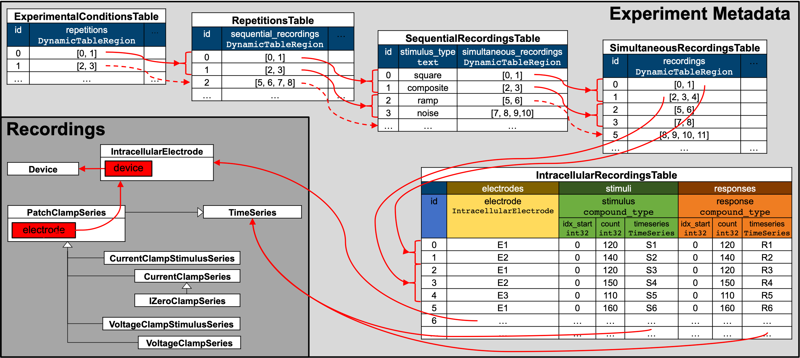
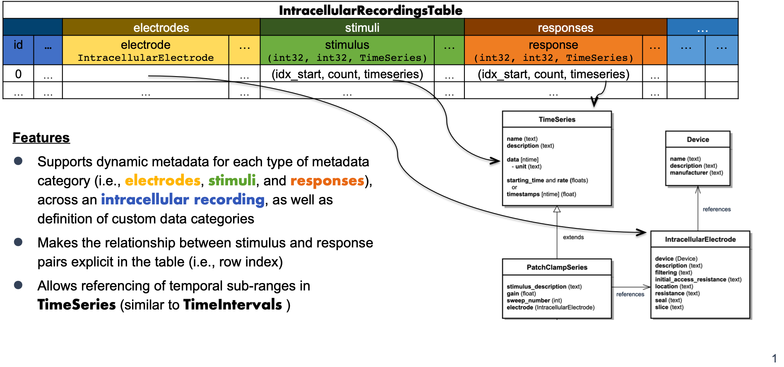

.. _icephys-tutorial:

Intracellular Electrophysiology
===============================

.. image:: https://www.mathworks.com/images/responsive/global/open-in-matlab-online.svg
   :target: https://matlab.mathworks.com/open/github/v1?repo=NeurodataWithoutBorders/matnwb&file=tutorials/icephys.mlx
   :alt: Open in MATLAB Online
.. image:: https://img.shields.io/badge/View-Rendered_Live_Script-blue
   :target: ../../_static/html/tutorials/icephys.html
   :alt: View rendered Live Script

.. contents:: On this page
   :local:
   :depth: 2

The following tutorial describes storage of intracellular electrophysiology data in NWB. NWB supports storage of the time series describing the stimulus and response, information about the electrode and device used, as well as metadata about the organization of the experiment.

**Tip**: This tutorial introduces many subtypes of the `DynamicTable <https://matnwb.readthedocs.io/en/latest/pages/neurodata_types/hdmf_common/DynamicTable.html>`_ type. For a detailed tutorial demonstrating how to work with dynamic tables, see the `DynamicTables <dynamic_tables>`_ tutorial.

*Illustration of the hierarchy of metadata tables used to describe the organization of intracellular electrophysiology experiments.*

Creating an NWBFile
-------------------

When creating an NWB file, the first step is to create the `NWBFile <https://matnwb.readthedocs.io/en/latest/pages/neurodata_types/core/NWBFile.html>`_, which you can create using the `NwbFile <https://matnwb.readthedocs.io/en/latest/pages/functions/NwbFile.html>`_ command.

.. code-block:: matlab

   session_start_time = datetime(2018, 3, 1, 12, 0, 0, 'TimeZone', 'local');
   
   nwbfile = NwbFile( ...
       'session_description', 'my first synthetic recording', ...
       'identifier', 'EXAMPLE_ID', ...
       'session_start_time', session_start_time, ...
       'general_experimenter', 'Dr. Bilbo Baggins', ...
       'general_lab', 'Bag End Laboratory', ...
       'general_institution', 'University of Middle Earth at the Shire', ...
       'general_experiment_description', ['I went on an adventure with thirteen dwarves ', ...
                                          'to reclaim vast treasures.'], ...
       'general_session_id', 'LONELYMTN' ...
   );

Subject Information
~~~~~~~~~~~~~~~~~~~

It is also recommended to store information about the experimental subject in the file. Create a `Subject <https://matnwb.readthedocs.io/en/latest/pages/neurodata_types/core/Subject.html>`_ object to store metadata about the subject, then assign it to ``nwb.general_subject``.

.. code-block:: matlab

   subject = types.core.Subject( ...
       'subject_id', '001', ...
       'age', 'P90D', ...
       'description', 'mouse 1', ...
       'species', 'Mus musculus', ...
       'sex', 'M' ...
   );
   nwb.general_subject = subject;

Device metadata
~~~~~~~~~~~~~~~

Device metadata is represented by `Device <https://matnwb.readthedocs.io/en/latest/pages/neurodata_types/core/Device.html>`_ objects.

.. code-block:: matlab

   device = types.core.Device();
   nwbfile.general_devices.set('Heka ITC-1600', device);

**Electrode metadata**
~~~~~~~~~~~~~~~~~~~~~~

Intracellular electrode metadata is represented by `IntracellularElectrode <https://matnwb.readthedocs.io/en/latest/pages/neurodata_types/core/IntracellularElectrode.html>`_ objects. Create an electrode object, which requires a link to the device of the previous step. Then add it to the NWB file.

.. code-block:: matlab

   electrode = types.core.IntracellularElectrode( ...
       'description', 'a mock intracellular electrode', ...
       'device', types.untyped.SoftLink(device), ...
       'cell_id', 'a very interesting cell' ...
   );
   nwbfile.general_intracellular_ephys.set('IntracellularElectrode', electrode);

**Stimulus and response data**
------------------------------

Intracellular stimulus and response data are represented with subclasses of `PatchClampSeries <https://matnwb.readthedocs.io/en/latest/pages/neurodata_types/core/PatchClampSeries.html>`_. A stimulus is described by a time series representing voltage or current stimulation with a particular set of parameters. There are two classes for representing stimulus data:

* `VoltageClampStimulusSeries <https://matnwb.readthedocs.io/en/latest/pages/neurodata_types/core/VoltageClampStimulusSeries.html>`_
* `CurrentClampStimulusSeries <https://matnwb.readthedocs.io/en/latest/pages/neurodata_types/core/CurrentClampStimulusSeries.html>`_

The response is then described by a time series representing voltage or current recorded from a single cell using a single intracellular electrode via one of the following classes:

* `VoltageClampSeries <https://matnwb.readthedocs.io/en/latest/pages/neurodata_types/core/VoltageClampSeries.html>`_
* `CurrentClampSeries <https://matnwb.readthedocs.io/en/latest/pages/neurodata_types/core/CurrentClampSeries.html>`_
* `IZeroClampSeries <https://matnwb.readthedocs.io/en/latest/pages/neurodata_types/core/IZeroClampSeries.html>`_

Below we create a simple example stimulus/response recording data pair for a voltage clamp recording.

.. code-block:: matlab

   vcss = types.core.VoltageClampStimulusSeries( ...
       'data', [1, 2, 3, 4, 5], ...
       'starting_time', 123.6, ...
       'starting_time_rate', 10e3, ...
       'electrode', types.untyped.SoftLink(electrode), ...
       'gain', 0.02, ...
       'sweep_number', uint64(15), ...
       'stimulus_description', 'N/A' ...
   );
   nwbfile.stimulus_presentation.set('VoltageClampStimulusSeries',  vcss);
   
   vcs = types.core.VoltageClampSeries( ...
       'data', [0.1, 0.2, 0.3, 0.4, 0.5], ...
       'data_conversion', 1e-12, ...
       'data_resolution', NaN, ...
       'starting_time', 123.6, ...
       'starting_time_rate', 20e3, ...
       'electrode', types.untyped.SoftLink(electrode), ...
       'gain', 0.02, ...
       'capacitance_slow', 100e-12, ...
       'resistance_comp_correction', 70.0, ...
       'stimulus_description', 'N/A', ...
       'sweep_number', uint64(15) ...
   );
   nwbfile.acquisition.set('VoltageClampSeries',  vcs);

You can add stimulus/response recording data pair from a current clamp recording in the same way:

.. code-block:: matlab

   % Create a CurrentClampStimulusSeries object
   ccss = types.core.CurrentClampStimulusSeries(...
       'data', [1, 2, 3, 4, 5], ...
       'starting_time', 123.6, ...
       'starting_time_rate', 10e3, ...
       'electrode', types.untyped.SoftLink(electrode), ...
       'gain', 0.02, ...
       'sweep_number', uint64(16), ...
       'stimulus_description', 'N/A' ...
   );
   nwbfile.stimulus_presentation.set('CurrentClampStimulusSeries',  ccss);
   
   % Create a CurrentClampSeries object
   ccs = types.core.CurrentClampSeries(...
       'data', [0.1, 0.2, 0.3, 0.4, 0.5], ...
       'data_conversion', 1e-12, ...
       'data_resolution', NaN, ...
       'starting_time', 123.6, ...
       'starting_time_rate', 20e3, ...
       'electrode', types.untyped.SoftLink(electrode), ...
       'gain', 0.02, ...
       'bias_current', 1e-12, ...
       'bridge_balance', 70e6, ...
       'capacitance_compensation', 1e-12, ...
       'stimulus_description', 'N/A', ...
       'sweep_number', uint64(16) ...
   );
   nwbfile.acquisition.set('CurrentClampSeries',  ccs);

`IZeroClampSeries <https://matnwb.readthedocs.io/en/latest/pages/neurodata_types/core/IZeroClampSeries.html>`_ is used when the current is clamped to 0.

.. code-block:: matlab

   % Create an IZeroClampSeries object
   izcs = types.core.IZeroClampSeries(...
       'data', [0.1, 0.2, 0.3, 0.4, 0.5], ...
       'electrode', types.untyped.SoftLink(electrode), ...
       'gain', 0.02, ...
       'data_conversion', 1e-12, ...
       'data_resolution', NaN, ...
       'starting_time', 345.6, ...
       'starting_time_rate', 20e3, ...
       'sweep_number', uint64(17) ...
   );
   nwbfile.acquisition.set('IZeroClampSeries',  izcs);

Adding an intracellular recording
~~~~~~~~~~~~~~~~~~~~~~~~~~~~~~~~~

The `IntracellularRecordingsTable <https://matnwb.readthedocs.io/en/latest/pages/neurodata_types/core/IntracellularRecordingsTable.html>`_ relates electrode, stimulus and response pairs and describes metadata specific to individual recordings.

*Illustration of the structure of the IntracellularRecordingsTable*

We can add an `IntracellularRecordingsTable <https://matnwb.readthedocs.io/en/latest/pages/neurodata_types/core/IntracellularRecordingsTable.html>`_ and add the `IntracellularElectrodesTable <https://matnwb.readthedocs.io/en/latest/pages/neurodata_types/core/IntracellularElectrodesTable.html>`_, `IntracellularStimuliTable <https://matnwb.readthedocs.io/en/latest/pages/neurodata_types/core/IntracellularStimuliTable.html>`_, and `IntracellularResponsesTable <https://matnwb.readthedocs.io/en/latest/pages/neurodata_types/core/IntracellularResponsesTable.html>`_ to it, then add them all to the `NWBFile <https://matnwb.readthedocs.io/en/latest/pages/neurodata_types/core/NWBFile.html>`_ object.

.. code-block:: matlab

   ic_rec_table = types.core.IntracellularRecordingsTable( ...
       'categories', {'electrodes', 'stimuli', 'responses'}, ...
       'colnames', {'recordings_tag'}, ...
       'description', [ ...
           'A table to group together a stimulus and response from a single ', ...
           'electrode and a single simultaneous recording and for storing ', ...
           'metadata about the intracellular recording.'], ...
       'id', types.hdmf_common.ElementIdentifiers('data', int64([0; 1; 2])), ...
       'recordings_tag', types.hdmf_common.VectorData( ...
           'data', repmat({'Tag'}, 3, 1), ...
           'description', 'Column for storing a custom recordings tag' ...
           ) ...
   );
   
   ic_rec_table.electrodes = types.core.IntracellularElectrodesTable( ...
       'description', 'Table for storing intracellular electrode related metadata.', ...
       'colnames', {'electrode'}, ...
       'id', types.hdmf_common.ElementIdentifiers( ...
           'data', int64([0; 1; 2]) ...
       ), ...
       'electrode', types.hdmf_common.VectorData( ...
           'data', repmat(types.untyped.ObjectView(electrode), 3, 1), ...
           'description', 'Column for storing the reference to the intracellular electrode' ...
       ) ...
   );
   
   % Note: For IZeroClampSeries (izcs), idx_start=-1 and count=-1 indicate no stimulus
   % was recorded (the amplifier is disconnected, so no stimulus can reach the cell).
   % The timeseries still points to the response series as described in the NWB spec
   % for the IntracellularRecordingsTable.
   ic_rec_table.stimuli = types.core.IntracellularStimuliTable( ...
       'description', 'Table for storing intracellular stimulus related metadata.', ...
       'colnames', {'stimulus'}, ...
       'id', types.hdmf_common.ElementIdentifiers( ...
           'data', int64([0; 1; 2]) ...
       ), ...
       'stimulus', types.core.TimeSeriesReferenceVectorData( ...
           'description', ['Column storing the reference to the recorded stimulus ', ...
                           'for the recording (rows)'], ...
           'data', struct( ...
               'idx_start', [0, 1, -1], ...
               'count', [5, 3, -1], ...
               'timeseries', [ ...
                   types.untyped.ObjectView(vcss), ... % Voltage clamp stimulus
                   types.untyped.ObjectView(ccss), ... % Current clamp stimulus
                   types.untyped.ObjectView(izcs) ...  % Current clamp response when current is off
               ] ...
           )...
       )...
   );
   
   ic_rec_table.responses = types.core.IntracellularResponsesTable( ...
       'description', 'Table for storing intracellular response related metadata.', ...
       'colnames', {'response'}, ...
       'id', types.hdmf_common.ElementIdentifiers( ...
           'data', int64([0; 1; 2]) ...
       ), ...
       'response', types.core.TimeSeriesReferenceVectorData( ...
           'description', ['Column storing the reference to the recorded response ', ...
                           'for the recording (rows)'], ...
           'data', struct( ...
               'idx_start', [0, 2, 0], ...
               'count', [5, 3, 5], ...
               'timeseries', [ ...
                   types.untyped.ObjectView(vcs), ... % Voltage clamp response
                   types.untyped.ObjectView(ccs), ... % Current clamp response
                   types.untyped.ObjectView(izcs) ... % Current clamp response when current is off
               ] ...
           )...
       )...
   );

The `IntracellularRecordingsTable <https://matnwb.readthedocs.io/en/latest/pages/neurodata_types/core/IntracellularRecordingsTable.html>`_ table is not just a `DynamicTable <https://matnwb.readthedocs.io/en/latest/pages/neurodata_types/hdmf_common/DynamicTable.html>`_ but an `AlignedDynamicTable <https://matnwb.readthedocs.io/en/latest/pages/neurodata_types/hdmf_common/AlignedDynamicTable.html>`_. The `AlignedDynamicTable <https://matnwb.readthedocs.io/en/latest/pages/neurodata_types/hdmf_common/AlignedDynamicTable.html>`_ type is itself a `DynamicTable <https://matnwb.readthedocs.io/en/latest/pages/neurodata_types/hdmf_common/DynamicTable.html>`_ that may contain an arbitrary number of additional `DynamicTable <https://matnwb.readthedocs.io/en/latest/pages/neurodata_types/hdmf_common/DynamicTable.html>`_, each of which defines a "category." This is similar to a table with “sub-headings”. In the case of the `IntracellularRecordingsTable <https://matnwb.readthedocs.io/en/latest/pages/neurodata_types/core/IntracellularRecordingsTable.html>`_, we have three predefined categories, i.e., electrodes, stimuli, and responses. We can also dynamically add new categories to the table. As each category corresponds to a `DynamicTable <https://matnwb.readthedocs.io/en/latest/pages/neurodata_types/hdmf_common/DynamicTable.html>`_, this means we have to create a new `DynamicTable <https://matnwb.readthedocs.io/en/latest/pages/neurodata_types/hdmf_common/DynamicTable.html>`_ and add it to our table.

.. code-block:: matlab

   % add category
   ic_rec_table.categories = [ic_rec_table.categories, {'recording_lab_data'}];
   ic_rec_table.dynamictable.set( ...
       'recording_lab_data', types.hdmf_common.DynamicTable( ...
           'description', 'category table for lab-specific recording metadata', ...
           'colnames', {'location'}, ...
           'id', types.hdmf_common.ElementIdentifiers( ...
               'data', int64([0; 1; 2]) ...
           ), ...
           'location', types.hdmf_common.VectorData( ...
               'data', {'Mordor', 'Gondor', 'Rohan'}, ...
               'description', 'Recording location in Middle Earth' ...
           ) ...
       ) ...
   );

In an `AlignedDynamicTable <https://matnwb.readthedocs.io/en/latest/pages/neurodata_types/hdmf_common/AlignedDynamicTable.html>`_ all category tables must align with the main table, i.e., all tables must have the same number of rows and rows are expected to correspond to each other by index.

We can also add custom columns to any of the subcategory tables, i.e., the electrodes, stimuli, and responses tables, and any custom subcategory tables. All we need to do is indicate the name of the category we want to add the column to.

.. code-block:: matlab

   % Add voltage threshold as column of electrodes table
   voltage_threshold_data = types.hdmf_common.VectorData( ...
       'data', [0.1; 0.12; 0.13], ...
       'description', 'Just an example column on the electrodes category table' ...
   );
   ic_rec_table.electrodes.addColumn('voltage_threshold', voltage_threshold_data)

The `IntracellularRecordingsTable <https://matnwb.readthedocs.io/en/latest/pages/neurodata_types/core/IntracellularRecordingsTable.html>`_ is added to the ``general_intracellular_ephys_intracellular_recordings`` property of the `NWBFile <https://matnwb.readthedocs.io/en/latest/pages/neurodata_types/core/NWBFile.html>`_ object:

.. code-block:: matlab

   nwbfile.general_intracellular_ephys_intracellular_recordings = ic_rec_table;

Hierarchical organization of recordings
---------------------------------------

To describe the organization of intracellular experiments, the metadata is organized hierarchically in a sequence of tables. All of the tables are so-called `DynamicTables <https://matnwb.readthedocs.io/en/latest/pages/neurodata_types/hdmf_common/DynamicTable.html>`_ enabling users to add columns for custom metadata. Storing data in hierarchical tables has the advantage that it allows us to avoid duplication of metadata. E.g., for a single experiment we only need to describe the metadata that is constant across an experimental condition as a single row in the `SimultaneousRecordingsTable <https://matnwb.readthedocs.io/en/latest/pages/neurodata_types/core/SimultaneousRecordingsTable.html>`_ without having to replicate the same information across all repetitions and sequential-, simultaneous-, and individual intracellular recordings. For analysis, this means that we can easily focus on individual aspects of an experiment while still being able to easily access information about information from related tables. All of these tables are optional, but to use one you must use all of the lower level tables, even if you only need a single row.

Add a simultaneous recording
~~~~~~~~~~~~~~~~~~~~~~~~~~~~

The `SimultaneousRecordingsTable <https://matnwb.readthedocs.io/en/latest/pages/neurodata_types/core/SimultaneousRecordingsTable.html>`_ groups intracellular recordings from the `IntracellularRecordingsTable <https://matnwb.readthedocs.io/en/latest/pages/neurodata_types/core/IntracellularRecordingsTable.html>`_ together that were recorded simultaneously from different electrodes and/or cells and describes metadata that is constant across the simultaneous recordings. In practice a simultaneous recording is often also referred to as a sweep. This example adds a custom column, "simultaneous_recording_tag".

.. code-block:: matlab

   % Create recordings_vector_data and recordings_vector_index using utility
   % function:
   [recordings_vector_data, recordings_vector_index] = util.create_indexed_column( ...
       {[0, 1, 2],}, ...
       'Column with references to one or more rows in the IntracellularRecordingsTable table', ...
       ic_rec_table);
   
   % Create simultaneous recordings table with custom column 'simultaneous_recording_tag'
   ic_sim_recs_table = types.core.SimultaneousRecordingsTable( ...
       'description', [ ...
           'A table for grouping different intracellular recordings from ', ...
           'the IntracellularRecordingsTable table together that were recorded ', ...
           'simultaneously from different electrodes.'...
       ], ...
       'colnames', {'recordings', 'simultaneous_recording_tag'}, ...
       'id', types.hdmf_common.ElementIdentifiers( ...
           'data', int64(12) ...
       ), ...
       'recordings', recordings_vector_data, ...
       'recordings_index', recordings_vector_index, ...
       'simultaneous_recording_tag', types.hdmf_common.VectorData( ...
           'description', 'A custom tag for simultaneous_recordings', ...
           'data', {'LabTag1'} ...
       ) ...
   );

Depending on the lab workflow, it may be useful to add complete columns to a table after we have already populated the table with rows. That would be done using the ``addColumn`` method:

.. code-block:: matlab

   simultaneous_recording_type_data = types.hdmf_common.VectorData(...
           'description', 'Description of the type of simultaneous_recording', ...
           'data', {'SimultaneousRecordingType1'} ...
   );
   ic_sim_recs_table.addColumn('simultaneous_recording_type', simultaneous_recording_type_data)

Display the simultaneous recordings table using the ``toTable`` method:

.. code-block:: matlab

   ic_sim_recs_table.toTable()

.. list-table::
   :header-rows: 1

   * - 
     - id
     - recordings
     - simultaneous_recording_tag
     - simultaneous_recording_type
   * - 1
     - 12
     - [0;1;2]
     - 'LabTag1'
     - 'SimultaneousRecordingType1'

The `SimultaneousRecordingsTable <https://matnwb.readthedocs.io/en/latest/pages/neurodata_types/core/SimultaneousRecordingsTable.html>`_ is added to the ``general_intracellular_ephys_simultaneous_recordings`` property of the `NWBFile <https://matnwb.readthedocs.io/en/latest/pages/neurodata_types/core/NWBFile.html>`_ object:

.. code-block:: matlab

   nwbfile.general_intracellular_ephys_simultaneous_recordings = ic_sim_recs_table;

Add a sequential recording
~~~~~~~~~~~~~~~~~~~~~~~~~~

The `SequentialRecordingsTable <https://matnwb.readthedocs.io/en/latest/pages/neurodata_types/core/SequentialRecordingsTable.html>`_ groups simultaneously recorded intracellular recordings from the `SimultaneousRecordingsTable <https://matnwb.readthedocs.io/en/latest/pages/neurodata_types/core/SimultaneousRecordingsTable.html>`_ together and describes metadata that is constant across the simultaneous recordings. In practice a sequential recording is often also referred to as a sweep sequence. A common use of sequential recordings is to group together simultaneous recordings where a sequence of stimuli of the same type with varying parameters have been presented in a sequence (e.g., a sequence of square waveforms with varying amplitude).

.. code-block:: matlab

   [simultaneous_recordings_vector_data, simultaneous_recordings_vector_index] = ...
       util.create_indexed_column( ...
           {0,}, ...
           'Column with references to one or more rows in the SimultaneousRecordingsTable table', ...
           ic_sim_recs_table);
   
   sequential_recordings = types.core.SequentialRecordingsTable( ...
       'description', [ ...
           'A table for grouping different intracellular recording ', ...
           'simultaneous_recordings from the SimultaneousRecordingsTable ', ...
           'table together. This is typically used to group together ', ...
           'simultaneous_recordings where a sequence of stimuli of ', ...
           'the same type with varying parameters have been presented in ', ...
           'a sequence.' ...
       ], ...
       'colnames', {'simultaneous_recordings', 'stimulus_type'}, ...
       'id', types.hdmf_common.ElementIdentifiers( ...
           'data', int64(15) ...
       ), ...
       'simultaneous_recordings', simultaneous_recordings_vector_data, ...
       'simultaneous_recordings_index', simultaneous_recordings_vector_index, ...
       'stimulus_type', types.hdmf_common.VectorData( ...
           'description', 'Column storing the type of stimulus used for the sequential recording', ...
           'data', {'square'} ...
       ) ...
   );

The `SequentialRecordingsTable <https://matnwb.readthedocs.io/en/latest/pages/neurodata_types/core/SequentialRecordingsTable.html>`_ is added to the ``general_intracellular_ephys_sequential_recordings`` property of the `NWBFile <https://matnwb.readthedocs.io/en/latest/pages/neurodata_types/core/NWBFile.html>`_ object:

.. code-block:: matlab

   nwbfile.general_intracellular_ephys_sequential_recordings = sequential_recordings;

Add repetitions table
~~~~~~~~~~~~~~~~~~~~~

The `RepetitionsTable <https://matnwb.readthedocs.io/en/latest/pages/neurodata_types/core/RepetitionsTable.html>`_ groups sequential recordings from the `SequentialRecordingsTable <https://matnwb.readthedocs.io/en/latest/pages/neurodata_types/core/SequentialRecordingsTable.html>`_. In practice, a repetition is often also referred to a run. A typical use of the `RepetitionsTable <https://matnwb.readthedocs.io/en/latest/pages/neurodata_types/core/RepetitionsTable.html>`_ is to group sets of different stimuli that are applied in sequence that may be repeated.

.. code-block:: matlab

   [sequential_recordings_vector_data, sequential_recordings_vector_index] = ...
       util.create_indexed_column( ...
           {0,}, ...
           'Column with references to one or more rows in the SequentialRecordingsTable table', ...
           sequential_recordings);
   
   nwbfile.general_intracellular_ephys_repetitions = types.core.RepetitionsTable( ...
       'description', [ ...
           'A table for grouping different intracellular recording sequential ', ...
           'recordings together. With each SimultaneousRecording typically ', ...
           'representing a particular type of stimulus, the RepetitionsTable ', ...
           'table is typically used to group sets of stimuli applied in sequence.' ...
       ], ...
       'colnames', {'sequential_recordings'}, ...
       'id', types.hdmf_common.ElementIdentifiers( ...
           'data', int64(17) ...
       ), ...
       'sequential_recordings', sequential_recordings_vector_data, ...
       'sequential_recordings_index', sequential_recordings_vector_index ...
   );

Add experimental condition table
~~~~~~~~~~~~~~~~~~~~~~~~~~~~~~~~

The `ExperimentalConditionsTable <https://matnwb.readthedocs.io/en/latest/pages/neurodata_types/core/ExperimentalConditionsTable.html>`_ groups repetitions of intracellular recording from the `RepetitionsTable <https://matnwb.readthedocs.io/en/latest/pages/neurodata_types/core/RepetitionsTable.html>`_ together that belong to the same experimental conditions.

.. code-block:: matlab

   [repetitions_vector_data, repetitions_vector_index] = util.create_indexed_column( ...
       {0, 0}, ...
       'Column with references to one or more rows in the RepetitionsTable table', ...
       nwbfile.general_intracellular_ephys_repetitions);
   
   nwbfile.general_intracellular_ephys_experimental_conditions = ...
       types.core.ExperimentalConditionsTable( ...
           'description', [ ...
               'A table for grouping different intracellular recording ', ...
               'repetitions together that belong to the same experimental ', ...
               'conditions.' ...
           ], ...
           'colnames', {'repetitions', 'tag'}, ...
           'id', types.hdmf_common.ElementIdentifiers( ...
               'data', int64([19; 21]) ...
           ), ...
           'repetitions', repetitions_vector_data, ...
           'repetitions_index', repetitions_vector_index, ...
           'tag', types.hdmf_common.VectorData( ...
               'description', 'integer tag for an experimental condition', ...
               'data', [1; 3] ...
           ) ...
   );

Write the NWB file
------------------

.. code-block:: matlab

   nwbExport(nwbfile, 'icephys_tutorial.nwb');

Read the NWB file
-----------------

.. code-block:: matlab

   nwbfile2 = nwbRead('icephys_tutorial.nwb', 'ignorecache')

.. code-block:: text

   nwbfile2 = 
     NwbFile with properties:
   
                                                nwb_version: '2.9.0'
                                           file_create_date: [1x1 types.untyped.DataStub]
                                                 identifier: 'EXAMPLE_ID'
                                        session_description: 'my first synthetic recording'
                                         session_start_time: [1x1 types.untyped.DataStub]
                                  timestamps_reference_time: [1x1 types.untyped.DataStub]
                                                acquisition: [3x1 types.untyped.Set]
                                                   analysis: [0x1 types.untyped.Set]
                                                    general: [0x1 types.untyped.Set]
                                    general_data_collection: ''
                                            general_devices: [1x1 types.untyped.Set]
                                     general_devices_models: [0x1 types.untyped.Set]
                             general_experiment_description: 'I went on an adventure with thirteen dwarves to reclaim vast treasures.'
                                       general_experimenter: [1x1 types.untyped.DataStub]
                                general_extracellular_ephys: [0x1 types.untyped.Set]
                     general_extracellular_ephys_electrodes: []
                                        general_institution: 'University of Middle Earth at the Shire'
                                general_intracellular_ephys: [1x1 types.untyped.Set]
        general_intracellular_ephys_experimental_conditions: [1x1 types.core.ExperimentalConditionsTable]
                      general_intracellular_ephys_filtering: ''
       general_intracellular_ephys_intracellular_recordings: [1x1 types.core.IntracellularRecordingsTable]
                    general_intracellular_ephys_repetitions: [1x1 types.core.RepetitionsTable]
          general_intracellular_ephys_sequential_recordings: [1x1 types.core.SequentialRecordingsTable]
        general_intracellular_ephys_simultaneous_recordings: [1x1 types.core.SimultaneousRecordingsTable]
                    general_intracellular_ephys_sweep_table: []
                                           general_keywords: ''
                                                general_lab: 'Bag End Laboratory'
                                              general_notes: ''
                                       general_optogenetics: [0x1 types.untyped.Set]
                                     general_optophysiology: [0x1 types.untyped.Set]
                                       general_pharmacology: ''
                                           general_protocol: ''
                               general_related_publications: ''
                                         general_session_id: 'LONELYMTN'
                                             general_slices: ''
                                      general_source_script: ''
                            general_source_script_file_name: ''
                                           general_stimulus: ''
                                            general_subject: []
                                            general_surgery: ''
                                              general_virus: ''
                                   general_was_generated_by: [1x1 types.untyped.DataStub]
                                                  intervals: [0x1 types.untyped.Set]
                                           intervals_epochs: []
                                    intervals_invalid_times: []
                                           intervals_trials: []
                                                 processing: [0x1 types.untyped.Set]
                                                    scratch: [0x1 types.untyped.Set]
                                      stimulus_presentation: [2x1 types.untyped.Set]
                                         stimulus_templates: [0x1 types.untyped.Set]
                                                      units: []
