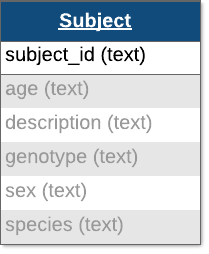
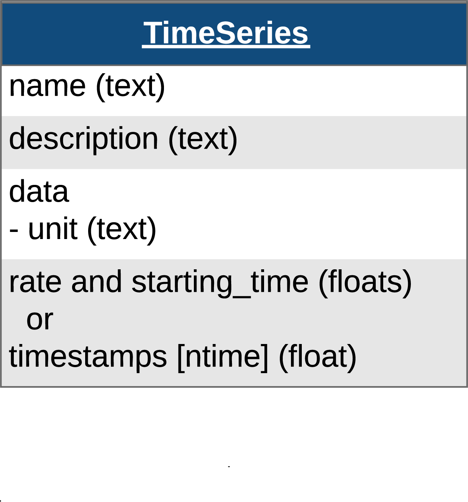
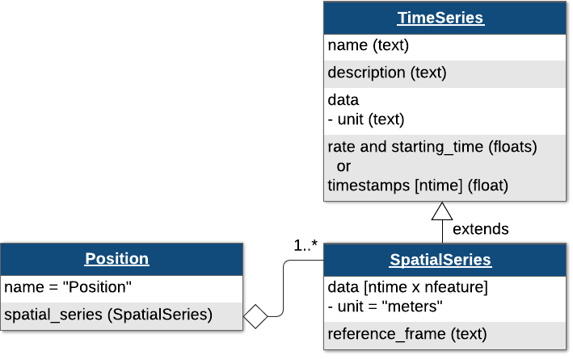
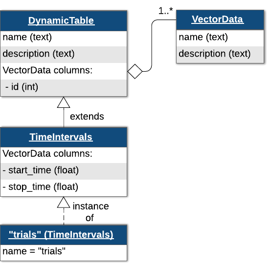
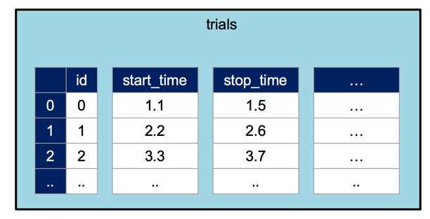
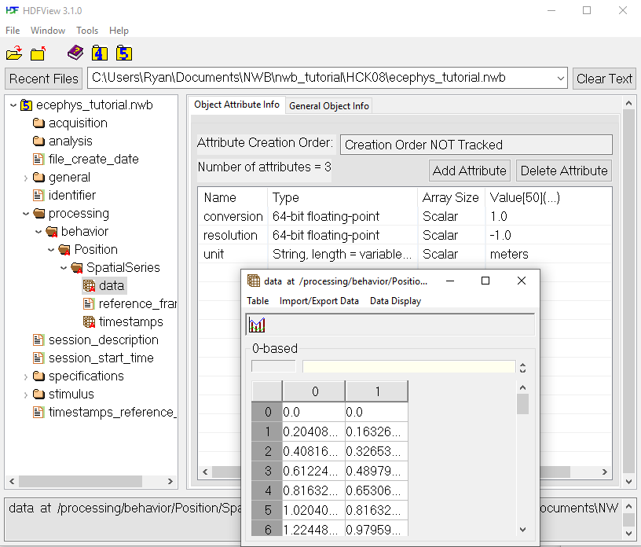

.. _intro-tutorial:

Getting Started with MatNWB
===========================

.. image:: https://www.mathworks.com/images/responsive/global/open-in-matlab-online.svg
   :target: https://matlab.mathworks.com/open/github/v1?repo=NeurodataWithoutBorders/matnwb&file=tutorials/intro.mlx
   :alt: Open in MATLAB Online
.. image:: https://img.shields.io/badge/View-Rendered_Live_Script-blue
   :target: ../../_static/html/tutorials/intro.html
   :alt: View rendered Live Script

.. contents:: On this page
   :local:
   :depth: 2

Installing MatNWB
-----------------

Use the code below within the brackets to install MatNWB from source. MatNWB works by automatically creating API classes based on the schema.

.. code-block:: matlab

   %{
   !git clone https://github.com/NeurodataWithoutBorders/matnwb.git
   addpath(genpath(pwd));
   %}

Set up the NWB File
-------------------

An NWB file represents a single session of an experiment. Each file must have a session_description, identifier, and session start time. Create a new `NWBFile <https://matnwb.readthedocs.io/en/latest/pages/neurodata_types/core/NWBFile.html>`_ object with those and additional metadata using the `NwbFile <https://matnwb.readthedocs.io/en/latest/pages/functions/NwbFile.html>`_ command. For all MatNWB classes and functions, we use the Matlab method of entering keyword argument pairs, where arguments are entered as name followed by value. Ellipses are used for clarity.

.. code-block:: matlab

   nwb = NwbFile( ...
       'session_description', 'mouse in open exploration',...
       'identifier', 'Mouse5_Day3', ...
       'session_start_time', datetime(2018, 4, 25, 2, 30, 3, 'TimeZone', 'local'), ...
       'general_experimenter', 'Last, First', ... % optional
       'general_session_id', 'session_1234', ... % optional
       'general_institution', 'University of My Institution', ... % optional
       'general_related_publications', {'DOI:10.1016/j.neuron.2016.12.011'}); % optional
   nwb

.. code-block:: text

   nwb = 
     NwbFile with properties:
   
                                                nwb_version: '2.9.0'
                                           file_create_date: []
                                                 identifier: 'Mouse5_Day3'
                                        session_description: 'mouse in open exploration'
                                         session_start_time: {[2018-04-25T02:30:03.000000+02:00]}
                                  timestamps_reference_time: []
                                                acquisition: [0x1 types.untyped.Set]
                                                   analysis: [0x1 types.untyped.Set]
                                                    general: [0x1 types.untyped.Set]
                                    general_data_collection: ''
                                            general_devices: [0x1 types.untyped.Set]
                                     general_devices_models: [0x1 types.untyped.Set]
                             general_experiment_description: ''
                                       general_experimenter: 'Last, First'
                                general_extracellular_ephys: [0x1 types.untyped.Set]
                     general_extracellular_ephys_electrodes: []
                                        general_institution: 'University of My Institution'
                                general_intracellular_ephys: [0x1 types.untyped.Set]
        general_intracellular_ephys_experimental_conditions: []
                      general_intracellular_ephys_filtering: ''
       general_intracellular_ephys_intracellular_recordings: []
                    general_intracellular_ephys_repetitions: []
          general_intracellular_ephys_sequential_recordings: []
        general_intracellular_ephys_simultaneous_recordings: []
                    general_intracellular_ephys_sweep_table: []
                                           general_keywords: ''
                                                general_lab: ''
                                              general_notes: ''
                                       general_optogenetics: [0x1 types.untyped.Set]
                                     general_optophysiology: [0x1 types.untyped.Set]
                                       general_pharmacology: ''
                                           general_protocol: ''
                               general_related_publications: {'DOI:10.1016/j.neuron.2016.12.011'}
                                         general_session_id: 'session_1234'
                                             general_slices: ''
                                      general_source_script: ''
                            general_source_script_file_name: ''
                                           general_stimulus: ''
                                            general_subject: []
                                            general_surgery: ''
                                              general_virus: ''
                                   general_was_generated_by: ''
                                                  intervals: [0x1 types.untyped.Set]
                                           intervals_epochs: []
                                    intervals_invalid_times: []
                                           intervals_trials: []
                                                 processing: [0x1 types.untyped.Set]
                                                    scratch: [0x1 types.untyped.Set]
                                      stimulus_presentation: [0x1 types.untyped.Set]
                                         stimulus_templates: [0x1 types.untyped.Set]
                                                      units: []

Subject Information
-------------------

You can also provide information about your subject in the NWB file. Create a `Subject <https://matnwb.readthedocs.io/en/latest/pages/neurodata_types/core/Subject.html>`_ object to store information such as age, species, genotype, sex, and a freeform description. Then set ``nwb.general_subject`` to the `Subject <https://matnwb.readthedocs.io/en/latest/pages/neurodata_types/core/Subject.html>`_ object.

Each of these fields is free-form, so any values will be valid, but here are our recommendations:

* For ``age``, we recommend using the `ISO 8601 Duration format <https://en.wikipedia.org/wiki/ISO_8601#Durations>`_
* For ``species``, we recommend using the formal latin binomal name (e.g. mouse -> *Mus musculus*, human -> *Homo sapiens*)
* For ``sex``, we recommend using F (female), M (male), U (unknown), and O (other)

.. code-block:: matlab

   subject = types.core.Subject( ...
       'subject_id', '005', ...
       'age', 'P90D', ...
       'description', 'mouse 5', ...
       'species', 'Mus musculus', ...
       'sex', 'M' ...
   );
   nwb.general_subject = subject;
   
   subject

.. code-block:: text

   subject = 
     Subject with properties:
   
                 age: 'P90D'
       age_reference: 'birth'
       date_of_birth: []
         description: 'mouse 5'
            genotype: ''
                 sex: 'M'
             species: 'Mus musculus'
              strain: ''
          subject_id: '005'
              weight: ''

Note: the DANDI archive requires all NWB files to have a subject object with subject_id specified, and strongly encourages specifying the other fields.

Time Series Data
----------------

`TimeSeries <https://matnwb.readthedocs.io/en/latest/pages/neurodata_types/core/TimeSeries.html>`_ is a common base class for measurements sampled over time, and provides fields for ``data`` and ``timestamps`` (regularly or irregularly sampled). You will also need to supply the ``name`` and ``unit`` of measurement (`SI unit <https://en.wikipedia.org/wiki/International_System_of_Units>`_).

For instance, we can store a `TimeSeries <https://matnwb.readthedocs.io/en/latest/pages/neurodata_types/core/TimeSeries.html>`_ data where recording started ``0.0`` seconds after ``start_time`` and sampled every second (1 Hz):

.. code-block:: matlab

   time_series_with_rate = types.core.TimeSeries( ...
       'description', 'an example time series', ...
       'data', linspace(0, 100, 10), ...
       'data_unit', 'm', ...
       'starting_time', 0.0, ...
       'starting_time_rate', 1.0);

For irregularly sampled recordings, we need to provide the ``timestamps`` for the ``data``:

.. code-block:: matlab

   time_series_with_timestamps = types.core.TimeSeries( ...
       'description', 'an example time series', ...
       'data', linspace(0, 100, 10), ...
       'data_unit', 'm', ...
       'timestamps', linspace(0, 1, 10));

The `TimeSeries <https://matnwb.readthedocs.io/en/latest/pages/neurodata_types/core/TimeSeries.html>`_ class serves as the foundation for all other time series types in the NWB format. Several specialized subclasses extend the functionality of `TimeSeries <https://matnwb.readthedocs.io/en/latest/pages/neurodata_types/core/TimeSeries.html>`_, each tailored to handle specific kinds of data. In the next section, we’ll explore one of these specialized types. For a full overview, please check out the `type hierarchy <https://nwb-schema.readthedocs.io/en/latest/format.html#type-hierarchy>`_ in the NWB schema documentation.

Other Types of Time Series
--------------------------

As mentioned previously, there are many subtypes of `TimeSeries <https://matnwb.readthedocs.io/en/latest/pages/neurodata_types/core/TimeSeries.html>`_ in MatNWB that are used to store different kinds of data. One example is `AnnotationSeries <https://matnwb.readthedocs.io/en/latest/pages/neurodata_types/core/AnnotationSeries.html>`_, a subclass of `TimeSeries <https://matnwb.readthedocs.io/en/latest/pages/neurodata_types/core/TimeSeries.html>`_ that stores text-based records about the experiment. Similar to our `TimeSeries <https://matnwb.readthedocs.io/en/latest/pages/neurodata_types/core/TimeSeries.html>`_ example above, we can create an `AnnotationSeries <https://matnwb.readthedocs.io/en/latest/pages/neurodata_types/core/AnnotationSeries.html>`_ object with text information about a stimulus and add it to the stimulus_presentation group in the `NWBFile <https://matnwb.readthedocs.io/en/latest/pages/neurodata_types/core/NWBFile.html>`_. Below is an example where we create an AnnotationSeries object with annotations for airpuff stimuli and add it to the NWBFile.

.. code-block:: matlab

   % Create an AnnotationSeries object with annotations for airpuff stimuli
   annotations = types.core.AnnotationSeries( ...
       'description', 'Airpuff events delivered to the animal', ...
       'data', {'Left Airpuff', 'Right Airpuff', 'Right Airpuff'}, ...
       'timestamps', [1.0, 3.0, 8.0] ...
   );
   
   % Add the AnnotationSeries to the NWBFile's stimulus group
   nwb.stimulus_presentation.set('Airpuffs', annotations)

.. code-block:: text

   ans = 
     Set with entries:
   
       Airpuffs: types.core.AnnotationSeries

Behavior
--------

SpatialSeries and Position
~~~~~~~~~~~~~~~~~~~~~~~~~~

Many types of data have special data types in NWB. To store the spatial position of a subject, we will use the `SpatialSeries <https://matnwb.readthedocs.io/en/latest/pages/neurodata_types/core/SpatialSeries.html>`_ and `Position <https://matnwb.readthedocs.io/en/latest/pages/neurodata_types/core/Position.html>`_ classes.

Note: These diagrams follow a standard convention called "UML class diagram" to express the object-oriented relationships between NWB classes. For our purposes, all you need to know is that an open triangle means "extends" (i.e., is a specialized subtype of), and an open diamond means "is contained within." Learn more about class diagrams on `the wikipedia page <https://en.wikipedia.org/wiki/Class_diagram>`_.

`SpatialSeries <https://matnwb.readthedocs.io/en/latest/pages/neurodata_types/core/SpatialSeries.html>`_ is a subclass of `TimeSeries <https://matnwb.readthedocs.io/en/latest/pages/neurodata_types/core/TimeSeries.html>`_, a common base class for measurements sampled over time, and provides fields for data and time (regularly or irregularly sampled). Here, we put a `SpatialSeries <https://matnwb.readthedocs.io/en/latest/pages/neurodata_types/core/SpatialSeries.html>`_ object called ``'SpatialSeries'`` in a `Position <https://matnwb.readthedocs.io/en/latest/pages/neurodata_types/core/Position.html>`_ object. If the data is sampled at a regular interval, it is recommended to specify the ``starting_time`` and the sampling rate (``starting_time_rate``), although it is still possible to specify ``timestamps`` as in the ``time_series_with_timestamps`` example above.

.. code-block:: matlab

   % create SpatialSeries object
   spatial_series_ts = types.core.SpatialSeries( ...
       'data', [linspace(0,10,100); linspace(0,8,100)], ...
       'reference_frame', '(0,0) is bottom left corner', ...
       'starting_time', 0, ...
       'starting_time_rate', 200 ...
   );
   
   % create Position object and add SpatialSeries
   position = types.core.Position('SpatialSeries', spatial_series_ts);

NWB differentiates between raw,  *acquired* data, which should never change, and  *processed* data, which are the results of preprocessing algorithms and could change. Let's assume that the animal's position was computed from a video tracking algorithm, so it would be classified as processed data. Since processed data can be very diverse, NWB allows us to create processing modules, which are like folders, to store related processed data or data that comes from a single algorithm.

Create a processing module called "behavior" for storing behavioral data in the `NWBFile <https://matnwb.readthedocs.io/en/latest/pages/neurodata_types/core/NWBFile.html>`_ and add the `Position <https://matnwb.readthedocs.io/en/latest/pages/neurodata_types/core/Position.html>`_ object to the module.

.. code-block:: matlab

   % create processing module
   behavior_module = types.core.ProcessingModule('description', 'contains behavioral data');
   
   % add the Position object (that holds the SpatialSeries object) to the module 
   % and name the Position object "Position"
   behavior_module.nwbdatainterface.set('Position', position);
   
   % add the processing module to the NWBFile object, and name the processing module "behavior"
   nwb.processing.set('behavior', behavior_module);

Trials
~~~~~~

Trials are stored in a `TimeIntervals <https://matnwb.readthedocs.io/en/latest/pages/neurodata_types/core/TimeIntervals.html>`_ object which is a subclass of `DynamicTable <https://matnwb.readthedocs.io/en/latest/pages/neurodata_types/hdmf_common/DynamicTable.html>`_. `DynamicTable <https://matnwb.readthedocs.io/en/latest/pages/neurodata_types/hdmf_common/DynamicTable.html>`_ objects are used to store tabular metadata throughout NWB, including for trials, electrodes, and sorted units. They offer flexibility for tabular data by allowing required columns, optional columns, and custom columns.

The trials `DynamicTable <https://matnwb.readthedocs.io/en/latest/pages/neurodata_types/hdmf_common/DynamicTable.html>`_ can be thought of as a table with this structure:

Trials are stored in a `TimeIntervals <https://matnwb.readthedocs.io/en/latest/pages/neurodata_types/core/TimeIntervals.html>`_ object which subclasses `DynamicTable <https://matnwb.readthedocs.io/en/latest/pages/neurodata_types/hdmf_common/DynamicTable.html>`_. Here, we are adding ``'correct'``, which will be a logical array.

.. code-block:: matlab

   trials = types.core.TimeIntervals( ...
       'colnames', {'start_time', 'stop_time', 'correct'}, ...
       'description', 'trial data and properties');
   
   trials.addRow('start_time', 0.1, 'stop_time', 1.0, 'correct', false)
   trials.addRow('start_time', 1.5, 'stop_time', 2.0, 'correct', true)
   trials.addRow('start_time', 2.5, 'stop_time', 3.0, 'correct', false)
   
   trials.toTable() % visualize the table

.. list-table::
   :header-rows: 1

   * - 
     - id
     - start_time
     - stop_time
     - correct
   * - 1
     - 0
     - 0.1000
     - 1
     - 0
   * - 2
     - 1
     - 1.5000
     - 2
     - 1
   * - 3
     - 2
     - 2.5000
     - 3
     - 0

.. code-block:: matlab

   nwb.intervals_trials = trials;
   
   % If you have multiple trials tables, you will need to use custom names for
   % each one:
   nwb.intervals.set('custom_intervals_table_name', trials);

Write
-----

Now, to write the NWB file that we have built so far:

.. code-block:: matlab

   nwbExport(nwb, 'intro_tutorial.nwb')

We can use the `HDFView <https://www.hdfgroup.org/downloads/hdfview/>`_ application to inspect the resulting NWB file.

Read
----

We can then read the file back in using MatNWB and inspect its contents.

.. code-block:: matlab

   read_nwbfile = nwbRead('intro_tutorial.nwb', 'ignorecache')

.. code-block:: text

   read_nwbfile = 
     NwbFile with properties:
   
                                                nwb_version: '2.9.0'
                                           file_create_date: [1x1 types.untyped.DataStub]
                                                 identifier: 'Mouse5_Day3'
                                        session_description: 'mouse in open exploration'
                                         session_start_time: [1x1 types.untyped.DataStub]
                                  timestamps_reference_time: [1x1 types.untyped.DataStub]
                                                acquisition: [0x1 types.untyped.Set]
                                                   analysis: [0x1 types.untyped.Set]
                                                    general: [0x1 types.untyped.Set]
                                    general_data_collection: ''
                                            general_devices: [0x1 types.untyped.Set]
                                     general_devices_models: [0x1 types.untyped.Set]
                             general_experiment_description: ''
                                       general_experimenter: [1x1 types.untyped.DataStub]
                                general_extracellular_ephys: [0x1 types.untyped.Set]
                     general_extracellular_ephys_electrodes: []
                                        general_institution: 'University of My Institution'
                                general_intracellular_ephys: [0x1 types.untyped.Set]
        general_intracellular_ephys_experimental_conditions: []
                      general_intracellular_ephys_filtering: ''
       general_intracellular_ephys_intracellular_recordings: []
                    general_intracellular_ephys_repetitions: []
          general_intracellular_ephys_sequential_recordings: []
        general_intracellular_ephys_simultaneous_recordings: []
                    general_intracellular_ephys_sweep_table: []
                                           general_keywords: ''
                                                general_lab: ''
                                              general_notes: ''
                                       general_optogenetics: [0x1 types.untyped.Set]
                                     general_optophysiology: [0x1 types.untyped.Set]
                                       general_pharmacology: ''
                                           general_protocol: ''
                               general_related_publications: [1x1 types.untyped.DataStub]
                                         general_session_id: 'session_1234'
                                             general_slices: ''
                                      general_source_script: ''
                            general_source_script_file_name: ''
                                           general_stimulus: ''
                                            general_subject: [1x1 types.core.Subject]
                                            general_surgery: ''
                                              general_virus: ''
                                   general_was_generated_by: [1x1 types.untyped.DataStub]
                                                  intervals: [1x1 types.untyped.Set]
                                           intervals_epochs: []
                                    intervals_invalid_times: []
                                           intervals_trials: [1x1 types.core.TimeIntervals]
                                                 processing: [1x1 types.untyped.Set]
                                                    scratch: [0x1 types.untyped.Set]
                                      stimulus_presentation: [1x1 types.untyped.Set]
                                         stimulus_templates: [0x1 types.untyped.Set]
                                                      units: []

We can print the `SpatialSeries <https://matnwb.readthedocs.io/en/latest/pages/neurodata_types/core/SpatialSeries.html>`_ data traversing the hierarchy of objects. The processing module called ``'behavior'`` contains our `Position <https://matnwb.readthedocs.io/en/latest/pages/neurodata_types/core/Position.html>`_ object named ``'Position'``. The `Position <https://matnwb.readthedocs.io/en/latest/pages/neurodata_types/core/Position.html>`_ object contains our `SpatialSeries <https://matnwb.readthedocs.io/en/latest/pages/neurodata_types/core/SpatialSeries.html>`_ object named ``'SpatialSeries'``.

.. code-block:: matlab

   read_spatial_series = read_nwbfile.processing.get('behavior'). ...
       nwbdatainterface.get('Position').spatialseries.get('SpatialSeries')

.. code-block:: text

   read_spatial_series = 
     SpatialSeries with properties:
   
           reference_frame: '(0,0) is bottom left corner'
        starting_time_unit: 'seconds'
       timestamps_interval: 1
           timestamps_unit: 'seconds'
                      data: [1x1 types.untyped.DataStub]
                 data_unit: 'meters'
                  comments: 'no comments'
                   control: []
       control_description: ''
           data_continuity: ''
           data_conversion: 1
               data_offset: 0
           data_resolution: -1
               description: 'no description'
             starting_time: 0
        starting_time_rate: 200
                timestamps: []

Reading Data
~~~~~~~~~~~~

Counter to normal MATLAB workflow, data arrays are read passively from the file. Calling ``read_spatial_series.data`` does not read the data values, but presents a ``DataStub`` object that can be indexed to read data.

.. code-block:: matlab

   read_spatial_series.data

.. code-block:: text

   ans = 
     DataStub with properties:
   
       filename: 'intro_tutorial.nwb'
           path: '/processing/behavior/Position/SpatialSeries/data'
           dims: [2 100]
          ndims: 2
       dataType: 'double'

This allows you to conveniently work with datasets that are too large to fit in RAM all at once. Access all the data in the matrix using the ``load`` method with no arguments.

.. code-block:: matlab

   read_spatial_series.data.load

.. code-block:: text

   ans = 2x100
            0    0.1010    0.2020    0.3030    0.4040    0.5051    0.6061    0.7071    0.8081    0.9091    1.0101    1.1111    1.2121    1.3131    1.4141    1.5152    1.6162    1.7172    1.8182    1.9192    2.0202    2.1212    2.2222    2.3232    2.4242    2.5253    2.6263    2.7273    2.8283    2.9293    3.0303    3.1313    3.2323    3.3333    3.4343    3.5354    3.6364    3.7374    3.8384    3.9394    4.0404    4.1414    4.2424    4.3434    4.4444    4.5455    4.6465    4.7475    4.8485    4.9495
            0    0.0808    0.1616    0.2424    0.3232    0.4040    0.4848    0.5657    0.6465    0.7273    0.8081    0.8889    0.9697    1.0505    1.1313    1.2121    1.2929    1.3737    1.4545    1.5354    1.6162    1.6970    1.7778    1.8586    1.9394    2.0202    2.1010    2.1818    2.2626    2.3434    2.4242    2.5051    2.5859    2.6667    2.7475    2.8283    2.9091    2.9899    3.0707    3.1515    3.2323    3.3131    3.3939    3.4747    3.5556    3.6364    3.7172    3.7980    3.8788    3.9596

If you only need a section of the data, you can read only that section by indexing the ``DataStub`` object like a normal array in MATLAB. This will just read the selected region from disk into RAM. This technique is particularly useful if you are dealing with a large dataset that is too big to fit entirely into your available RAM.

.. code-block:: matlab

   read_spatial_series.data(:, 1:10)

.. code-block:: text

   ans = 2x10
            0    0.1010    0.2020    0.3030    0.4040    0.5051    0.6061    0.7071    0.8081    0.9091
            0    0.0808    0.1616    0.2424    0.3232    0.4040    0.4848    0.5657    0.6465    0.7273

Next Steps
----------

This concludes the introductory tutorial. Please proceed to one of the specialized tutorials, which are designed to follow this one.

* `Extracellular electrophysiology <ecephys>`_
* `Intracellular electrophysiology <icephys>`_
* `Optical physiology <ophys>`_

See the `API documentation <https://matnwb.readthedocs.io/en/latest/pages/neurodata_types/core/index.html>`_ to learn what data types are available.
