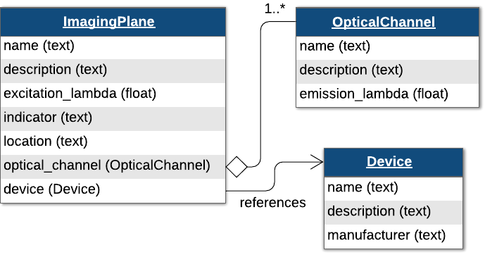
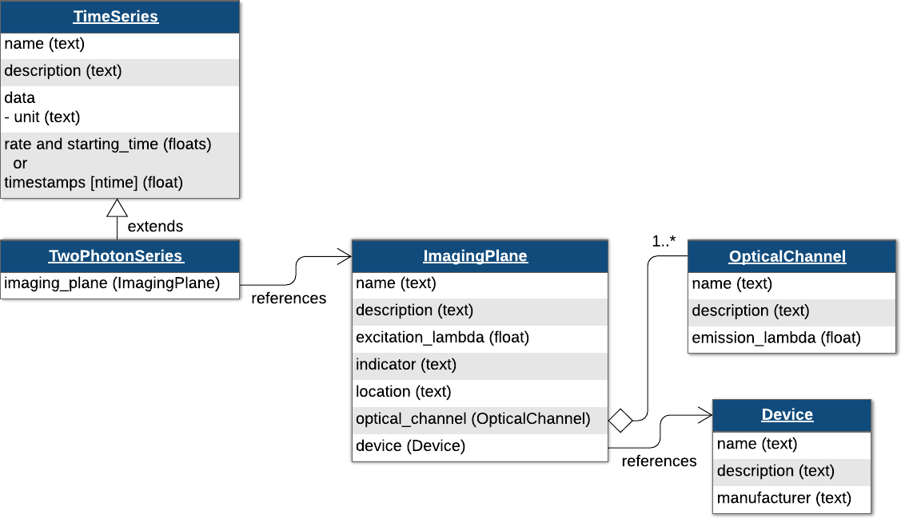
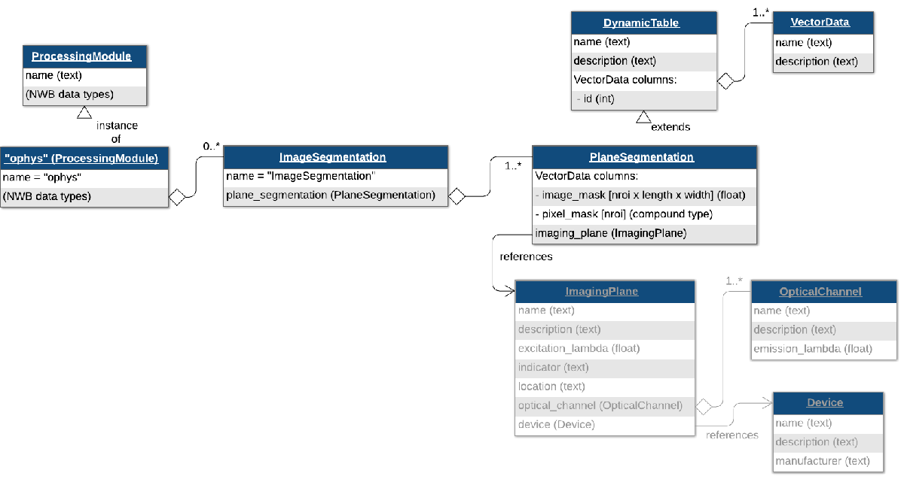
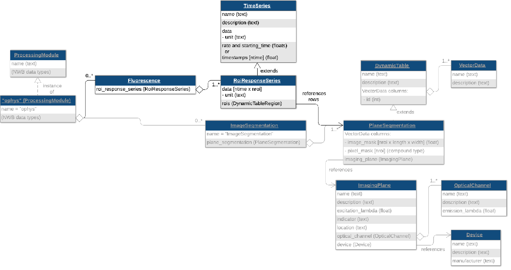
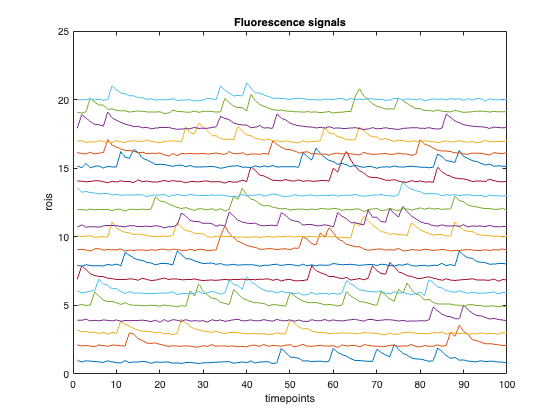
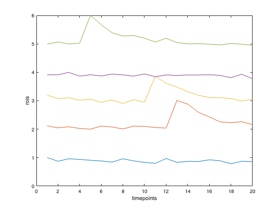
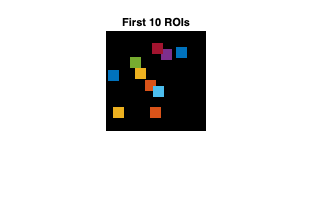

.. _ophys-tutorial:

Calcium Imaging 🎬
==================

.. image:: https://www.mathworks.com/images/responsive/global/open-in-matlab-online.svg
   :target: https://matlab.mathworks.com/open/github/v1?repo=NeurodataWithoutBorders/matnwb&file=tutorials/ophys.mlx
   :alt: Open in MATLAB Online
.. image:: https://img.shields.io/badge/View-Rendered_Live_Script-blue
   :target: ../../_static/html/tutorials/ophys.html
   :alt: View rendered Live Script
.. image:: https://img.shields.io/badge/View-Youtube-red
   :target: https://www.youtube.com/watch?v=OBidHdocnTc&ab_channel=NeurodataWithoutBorders
   :alt: View tutorial on YouTube

.. contents:: On this page
   :local:
   :depth: 2

Introduction
------------

In this tutorial, we will create fake data for a hypothetical optical physiology experiment with a freely moving animal. The types of data we will convert are:

* Acquired two-photon images
* Image segmentation (ROIs)
* Fluorescence and dF/F response

It is recommended to first work through the `Introduction to MatNWB tutorial <intro>`_, which demonstrates installing MatNWB and creating an NWB file with subject information, animal position, and trials, as well as writing and reading NWB files in MATLAB.

**Please note**: The dimensions of timeseries data in MatNWB should be defined in the opposite order of how it is defined in the nwb-schemas. In NWB, time is always stored in the first dimension of the data, whereas in MatNWB data should be specified with time along the last dimension. This is explained in more detail here: `MatNWB <-> HDF5 Dimension Mapping <dimensionMapNoDataPipes>`_.

Set up the NWB file
-------------------

An NWB file represents a single session of an experiment. Each file must have a session_description, identifier, and session start time. Create a new ``NWBFile`` object with those and additional metadata. For all MatNWB functions, we use the Matlab method of entering keyword argument pairs, where arguments are entered as name followed by value.

.. code-block:: matlab

   nwb = NwbFile( ...
       'identifier', 'matnwb_ophys_tutorial', ...
       'session_description', 'mouse in open exploration',...
       'session_start_time', datetime(2018, 4, 25, 2, 30, 3, 'TimeZone', 'local'), ...
       'timestamps_reference_time', datetime(2018, 4, 25, 3, 0, 45, 'TimeZone', 'local'), ...
       'general_experimenter', 'LastName, FirstName', ... % optional
       'general_session_id', 'Mouse5_Day3', ... % optional
       'general_institution', 'University of My Institution', ... % optional
       'general_related_publications', {'DOI:10.1016/j.neuron.2016.12.011'}); % optional
   nwb

.. code-block:: text

   nwb = 
     NwbFile with properties:
   
                                                nwb_version: '2.9.0'
                                           file_create_date: []
                                                 identifier: 'matnwb_ophys_tutorial'
                                        session_description: 'mouse in open exploration'
                                         session_start_time: {[2018-04-25T02:30:03.000000+02:00]}
                                  timestamps_reference_time: {[2018-04-25T03:00:45.000000+02:00]}
                                                acquisition: [0x1 types.untyped.Set]
                                                   analysis: [0x1 types.untyped.Set]
                                                    general: [0x1 types.untyped.Set]
                                    general_data_collection: ''
                                            general_devices: [0x1 types.untyped.Set]
                                     general_devices_models: [0x1 types.untyped.Set]
                             general_experiment_description: ''
                                       general_experimenter: 'LastName, FirstName'
                                general_extracellular_ephys: [0x1 types.untyped.Set]
                     general_extracellular_ephys_electrodes: []
                                        general_institution: 'University of My Institution'
                                general_intracellular_ephys: [0x1 types.untyped.Set]
        general_intracellular_ephys_experimental_conditions: []
                      general_intracellular_ephys_filtering: ''
       general_intracellular_ephys_intracellular_recordings: []
                    general_intracellular_ephys_repetitions: []
          general_intracellular_ephys_sequential_recordings: []
        general_intracellular_ephys_simultaneous_recordings: []
                    general_intracellular_ephys_sweep_table: []
                                           general_keywords: ''
                                                general_lab: ''
                                              general_notes: ''
                                       general_optogenetics: [0x1 types.untyped.Set]
                                     general_optophysiology: [0x1 types.untyped.Set]
                                       general_pharmacology: ''
                                           general_protocol: ''
                               general_related_publications: {'DOI:10.1016/j.neuron.2016.12.011'}
                                         general_session_id: 'Mouse5_Day3'
                                             general_slices: ''
                                      general_source_script: ''
                            general_source_script_file_name: ''
                                           general_stimulus: ''
                                            general_subject: []
                                            general_surgery: ''
                                              general_virus: ''
                                   general_was_generated_by: ''
                                                  intervals: [0x1 types.untyped.Set]
                                           intervals_epochs: []
                                    intervals_invalid_times: []
                                           intervals_trials: []
                                                 processing: [0x1 types.untyped.Set]
                                                    scratch: [0x1 types.untyped.Set]
                                      stimulus_presentation: [0x1 types.untyped.Set]
                                         stimulus_templates: [0x1 types.untyped.Set]
                                                      units: []

Subject Information
~~~~~~~~~~~~~~~~~~~

It is recommended to store information about the experimental subject in the file. Create a `Subject <https://matnwb.readthedocs.io/en/latest/pages/neurodata_types/core/Subject.html>`_ object to store metadata about the subject, then assign it to ``nwb.general_subject``.

.. code-block:: matlab

   subject = types.core.Subject( ...
       'subject_id', '005', ...
       'age', 'P90D', ...
       'description', 'mouse 5', ...
       'species', 'Mus musculus', ...
       'sex', 'M' ...
   );
   nwb.general_subject = subject;

Optical Physiology
------------------

Optical physiology results are written in four steps:

1. Create imaging plane
2. Acquired two-photon images
3. Image segmentation
4. Fluorescence and dF/F responses

Imaging Plane
~~~~~~~~~~~~~

First, you must create an `ImagingPlane <https://matnwb.readthedocs.io/en/latest/pages/neurodata_types/core/ImagingPlane.html>`_ object, which will hold information about the area and method used to collect the optical imaging data. This requires creation of a `Device <https://matnwb.readthedocs.io/en/latest/pages/neurodata_types/core/Device.html>`_ object for the microscope and an `OpticalChannel <https://matnwb.readthedocs.io/en/latest/pages/neurodata_types/core/OpticalChannel.html>`_ object. Then you can create an `ImagingPlane <https://matnwb.readthedocs.io/en/latest/pages/neurodata_types/core/ImagingPlane.html>`_.

Create a `Device <https://matnwb.readthedocs.io/en/latest/pages/neurodata_types/core/Device.html>`_ representing a two-photon microscope. The fields ``description``, ``manufacturer``, ``model_number``, ``model_name``, and ``serial_number`` are optional, but recommended. Then create an `OpticalChannel <https://matnwb.readthedocs.io/en/latest/pages/neurodata_types/core/OpticalChannel.html>`_ and add both of these to the `ImagingPlane <https://matnwb.readthedocs.io/en/latest/pages/neurodata_types/core/ImagingPlane.html>`_.

.. code-block:: matlab

   device = types.core.Device( ...
       'description', 'My two-photon microscope', ...
       'manufacturer', 'Loki Labs', ...
       'model_number', 'ABC-123', ...
       'model_name', 'Loki 1.0', ...
       'serial_number', '1234567890');
   
   % Add device to nwb object
   nwb.general_devices.set('Device', device);
   
   optical_channel = types.core.OpticalChannel( ...
       'description', 'description', ...
       'emission_lambda', 500.);
   
   imaging_plane_name = 'imaging_plane';
   imaging_plane = types.core.ImagingPlane( ...
       'optical_channel', optical_channel, ...
       'description', 'a very interesting part of the brain', ...
       'device', types.untyped.SoftLink(device), ...
       'excitation_lambda', 600., ...
       'imaging_rate', 5., ...
       'indicator', 'GFP', ...
       'location', 'Primary visual area');
   
   nwb.general_optophysiology.set(imaging_plane_name, imaging_plane);

Storing Two-Photon Data
~~~~~~~~~~~~~~~~~~~~~~~

You can create a `TwoPhotonSeries <https://matnwb.readthedocs.io/en/latest/pages/neurodata_types/core/TwoPhotonSeries.html>`_ class representing two photon imaging data. `TwoPhotonSeries <https://matnwb.readthedocs.io/en/latest/pages/neurodata_types/core/TwoPhotonSeries.html>`_, like `SpatialSeries <https://matnwb.readthedocs.io/en/latest/pages/neurodata_types/core/SpatialSeries.html>`_, inherits from `TimeSeries <https://matnwb.readthedocs.io/en/latest/pages/neurodata_types/core/TimeSeries.html>`_ and is similar in behavior to `OnePhotonSeries <https://matnwb.readthedocs.io/en/latest/pages/neurodata_types/core/OnePhotonSeries.html>`_.

.. code-block:: matlab

   InternalTwoPhoton = types.core.TwoPhotonSeries( ...
       'imaging_plane', types.untyped.SoftLink(imaging_plane), ...
       'starting_time', 0.0, ...
       'starting_time_rate', 3.0, ...
       'data', ones(200, 100, 1000), ...
       'data_unit', 'lumens');
   
   nwb.acquisition.set('2pInternal', InternalTwoPhoton);

Storing One-Photon Data
~~~~~~~~~~~~~~~~~~~~~~~

Now that we have our `ImagingPlane <https://matnwb.readthedocs.io/en/latest/pages/neurodata_types/core/ImagingPlane.html>`_, we can create a `OnePhotonSeries <https://matnwb.readthedocs.io/en/latest/pages/neurodata_types/core/OnePhotonSeries.html>`_ object to store raw one-photon imaging data.

.. code-block:: matlab

   % using internal data. this data will be stored inside the NWB file
   InternalOnePhoton = types.core.OnePhotonSeries( ...
       'data', ones(100, 100, 1000), ... 
       'imaging_plane', types.untyped.SoftLink(imaging_plane), ...
       'starting_time', 0., ...
       'starting_time_rate', 1.0, ...
       'data_unit', 'normalized amplitude' ...
   );
   nwb.acquisition.set('1pInternal', InternalOnePhoton);

Motion Correction (optional)
~~~~~~~~~~~~~~~~~~~~~~~~~~~~

You can also store the result of motion correction using a `MotionCorrection <https://matnwb.readthedocs.io/en/latest/pages/neurodata_types/core/MotionCorrection.html>`_ object, a container type that can hold one or more `CorrectedImageStack <https://matnwb.readthedocs.io/en/latest/pages/neurodata_types/core/CorrectedImageStack.html>`_ objects.

.. code-block:: matlab

   % Create the corrected ImageSeries
   corrected = types.core.ImageSeries( ...
       'description', 'A motion corrected image stack', ...
       'data', ones(100, 100, 1000), ...  % 3D data array
       'data_unit', 'n/a', ...
       'format', 'raw', ...
       'starting_time', 0.0, ...
       'starting_time_rate', 1.0 ...
   );
   
   % Create the xy_translation TimeSeries
   xy_translation = types.core.TimeSeries( ...
       'description', 'x,y translation in pixels', ...
       'data', ones(2, 1000), ...  % 2D data array
       'data_unit', 'pixels', ...
       'starting_time', 0.0, ...
       'starting_time_rate', 1.0 ...
   );
   
   % Create the CorrectedImageStack
   corrected_image_stack = types.core.CorrectedImageStack( ...
       'corrected', corrected, ...
       'original', types.untyped.SoftLink(InternalOnePhoton), ... % Ensure `InternalOnePhoton` exists
       'xy_translation', xy_translation ...
   );
   
   % Create the MotionCorrection object
   motion_correction = types.core.MotionCorrection();
   motion_correction.correctedimagestack.set('CorrectedImageStack', corrected_image_stack);

The motion corrected data is considered processed data and will be added to the ``processing`` field of the ``nwb`` object using a `ProcessingModule <https://matnwb.readthedocs.io/en/latest/pages/neurodata_types/core/ProcessingModule.html>`_ called "``ophys``". First, create the `ProcessingModule <https://matnwb.readthedocs.io/en/latest/pages/neurodata_types/core/ProcessingModule.html>`_ object and then add the ``motion_correction`` object to it, naming it "``MotionCorrection``".

.. code-block:: matlab

   ophys_module = types.core.ProcessingModule( ...
       'description', 'Contains optical physiology data');
   ophys_module.nwbdatainterface.set('MotionCorrection', motion_correction);

Finally, add the "ophys" `ProcessingModule <https://matnwb.readthedocs.io/en/latest/pages/neurodata_types/core/ProcessingModule.html>`_ to the ``nwb`` (Note that we can continue adding objects to the "ophys" `ProcessingModule <https://matnwb.readthedocs.io/en/latest/pages/neurodata_types/core/ProcessingModule.html>`_ without needing to explicitly update the nwb):

.. code-block:: matlab

   nwb.processing.set('ophys', ophys_module);

Plane Segmentation
~~~~~~~~~~~~~~~~~~

Image segmentation stores the detected regions of interest in the `TwoPhotonSeries <https://matnwb.readthedocs.io/en/latest/pages/neurodata_types/core/TwoPhotonSeries.html>`_ data. `ImageSegmentation <https://matnwb.readthedocs.io/en/latest/pages/neurodata_types/core/ImageSegmentation.html>`_ allows you to have more than one segmentation by creating more `PlaneSegmentation <https://matnwb.readthedocs.io/en/latest/pages/neurodata_types/core/PlaneSegmentation.html>`_ objects.

Regions of interest (ROIs)
~~~~~~~~~~~~~~~~~~~~~~~~~~

ROIs can be added to a `PlaneSegmentation <https://matnwb.readthedocs.io/en/latest/pages/neurodata_types/core/PlaneSegmentation.html>`_ either as an image_mask **or** as a pixel_mask. An image mask is an array that is the same size as a single frame of the `TwoPhotonSeries <https://matnwb.readthedocs.io/en/latest/pages/neurodata_types/core/TwoPhotonSeries.html>`_, and indicates where a single region of interest is. This image mask may be boolean or continuous between 0 and 1. A pixel_mask, on the other hand, is a list of indices (i.e coordinates) and weights for the ROI. The pixel_mask is represented as a compound data type using a `ragged array <https://nwb-schema.readthedocs.io/en/latest/format_description.html#tables-and-ragged-arrays>`_ and below is an example demonstrating how to create either an image_mask or a pixel_mask. Changing the dropdown selection will update the `PlaneSegmentation <https://matnwb.readthedocs.io/en/latest/pages/neurodata_types/core/PlaneSegmentation.html>`_ object accordingly.

.. code-block:: matlab

   selection = "Create Image Mask"; % "Create Image Mask" or "Create Pixel Mask"
   
   % generate fake image_mask data
   imaging_shape = [100, 100];
   x = imaging_shape(1);
   y = imaging_shape(2);
   
   n_rois = 20;
   image_mask = zeros(y, x, n_rois);
   center = generateCenterCoords(90,2,n_rois);
   for i = 1:n_rois
       image_mask(center(1,i):center(1,i)+10, center(2,i):center(2,i)+10, i) = 1;
   end
   
   if selection == "Create Pixel Mask"
       ind = find(image_mask);
       [y_ind, x_ind, roi_ind] = ind2sub(size(image_mask), ind);
   
       pixel_mask_struct = struct();
       pixel_mask_struct.x = uint32(x_ind); % Add x coordinates to struct field x
       pixel_mask_struct.y = uint32(y_ind); % Add y coordinates to struct field y
       pixel_mask_struct.weight = single(ones(size(x_ind))); 
       
       % Create pixel mask vector data
       pixel_mask = types.hdmf_common.VectorData(...
               'data', struct2table(pixel_mask_struct), ...
               'description', 'pixel masks');
   
       % When creating a pixel mask, it is also necessary to specify a
       % pixel_mask_index vector. See the documentation for ragged arrays linked
       % above to learn more.
       num_pixels_per_roi = zeros(n_rois, 1); % Column vector
       for i_roi = 1:n_rois
           num_pixels_per_roi(i_roi) = sum(roi_ind == i_roi);
       end
   
       pixel_mask_index = uint16(cumsum(num_pixels_per_roi)); % Note: Use an integer 
       % type that can accommodate the maximum value of the cumulative sum
   
       % Create pixel_mask_index vector
       pixel_mask_index = types.hdmf_common.VectorIndex(...
               'description', 'Index into pixel_mask VectorData', ...
               'data', pixel_mask_index, ...
               'target', types.untyped.ObjectView(pixel_mask) );
   
       plane_segmentation = types.core.PlaneSegmentation( ...
           'colnames', {'pixel_mask'}, ...
           'description', 'roi pixel position (x,y) and pixel weight', ...
           'imaging_plane', types.untyped.SoftLink(imaging_plane), ...
           'pixel_mask_index', pixel_mask_index, ...
           'pixel_mask', pixel_mask ...
       );
   
   else % selection == "Create Image Mask"
       plane_segmentation = types.core.PlaneSegmentation( ...
           'colnames', {'image_mask'}, ...
           'description', 'output from segmenting my favorite imaging plane', ...
           'imaging_plane', types.untyped.SoftLink(imaging_plane), ...
           'image_mask', types.hdmf_common.VectorData(...
               'data', image_mask, ...
               'description', 'image masks') ...
       );
   end

Adding ROIs to NWB file
~~~~~~~~~~~~~~~~~~~~~~~

Now create an `ImageSegmentation <https://matnwb.readthedocs.io/en/latest/pages/neurodata_types/core/ImageSegmentation.html>`_ object and put the ``plane_segmentation`` object inside of it, naming it "``PlaneSegmentation"``.

.. code-block:: matlab

   img_seg = types.core.ImageSegmentation();
   img_seg.planesegmentation.set('PlaneSegmentation', plane_segmentation);

Add the ``img_seg`` object to the "ophys" `ProcessingModule <https://matnwb.readthedocs.io/en/latest/pages/neurodata_types/core/ProcessingModule.html>`_ we created before, naming it "``ImageSegmentation``".

.. code-block:: matlab

   ophys_module.nwbdatainterface.set('ImageSegmentation', img_seg);

Storing fluorescence of ROIs over time
~~~~~~~~~~~~~~~~~~~~~~~~~~~~~~~~~~~~~~

Now that ROIs are stored, you can store fluorescence data for these regions of interest. This type of data is stored using the `RoiResponseSeries <https://matnwb.readthedocs.io/en/latest/pages/neurodata_types/core/RoiResponseSeries.html>`_ class.

To create a `RoiResponseSeries <https://matnwb.readthedocs.io/en/latest/pages/neurodata_types/core/RoiResponseSeries.html>`_ object, we will need to reference a set of rows from the `PlaneSegmentation <https://matnwb.readthedocs.io/en/latest/pages/neurodata_types/core/PlaneSegmentation.html>`_ table to indicate which ROIs correspond to which rows of your recorded data matrix. This is done using a `DynamicTableRegion <https://matnwb.readthedocs.io/en/latest/pages/neurodata_types/hdmf_common/DynamicTableRegion.html>`_, which is a type of link that allows you to reference specific rows of a `DynamicTable <https://matnwb.readthedocs.io/en/latest/pages/neurodata_types/hdmf_common/DynamicTable.html>`_, such as a `PlaneSegmentation <https://matnwb.readthedocs.io/en/latest/pages/neurodata_types/core/PlaneSegmentation.html>`_ table by row indices.

First, we create a `DynamicTableRegion <https://matnwb.readthedocs.io/en/latest/pages/neurodata_types/hdmf_common/DynamicTableRegion.html>`_ that references the ROIs of the `PlaneSegmentation <https://matnwb.readthedocs.io/en/latest/pages/neurodata_types/core/PlaneSegmentation.html>`_ table.

.. code-block:: matlab

   roi_table_region = types.hdmf_common.DynamicTableRegion( ...
       'table', types.untyped.ObjectView(plane_segmentation), ...
       'description', 'all_rois', ...
       'data', (0:n_rois-1)');

Then we create a `RoiResponseSeries <https://matnwb.readthedocs.io/en/latest/pages/neurodata_types/core/RoiResponseSeries.html>`_ object to store fluorescence data for those ROIs.

.. code-block:: matlab

   data = generateCalciumResponses(n_rois, 100); % [nRoi, nT]
   roi_response_series = types.core.RoiResponseSeries( ...
       'rois', roi_table_region, ...
       'data', data, ...
       'data_unit', 'lumens', ...
       'starting_time_rate', 3.0, ...
       'starting_time', 0.0);

To help data analysis and visualization tools know that this `RoiResponseSeries <https://matnwb.readthedocs.io/en/latest/pages/neurodata_types/core/RoiResponseSeries.html>`_ object represents fluorescence data, we will store the `RoiResponseSeries <https://matnwb.readthedocs.io/en/latest/pages/neurodata_types/core/RoiResponseSeries.html>`_ object inside of a `Fluorescence <https://matnwb.readthedocs.io/en/latest/pages/neurodata_types/core/Fluorescence.html>`_ object. Then we add the `Fluorescence <https://matnwb.readthedocs.io/en/latest/pages/neurodata_types/core/Fluorescence.html>`_ object into the same `ProcessingModule <https://matnwb.readthedocs.io/en/latest/pages/neurodata_types/core/ProcessingModule.html>`_ named ``"ophys"`` that we created earlier.

.. code-block:: matlab

   fluorescence = types.core.Fluorescence();
   fluorescence.roiresponseseries.set('RoiResponseSeries', roi_response_series);
   
   ophys_module.nwbdatainterface.set('Fluorescence', fluorescence);

**Tip**: If you want to store dF/F data instead of fluorescence data, then store the `RoiResponseSeries <https://matnwb.readthedocs.io/en/latest/pages/neurodata_types/core/RoiResponseSeries.html>`_ object in a `DfOverF <https://matnwb.readthedocs.io/en/latest/pages/neurodata_types/core/DfOverF.html>`_ object, which works the same way as the `Fluorescence <https://matnwb.readthedocs.io/en/latest/pages/neurodata_types/core/Fluorescence.html>`_ class.

Writing the NWB file
--------------------

.. code-block:: matlab

   nwb_file_name = 'ophys_tutorial.nwb';
   if isfile(nwb_file_name); delete(nwb_file_name); end
   nwbExport(nwb, nwb_file_name);

Reading the NWB file
--------------------

.. code-block:: matlab

   read_nwb = nwbRead(nwb_file_name, 'ignorecache');

Data arrays are read passively from the file. Calling ``TimeSeries.data`` does not read the data values, but presents an HDF5 object that can be indexed to read data.

.. code-block:: matlab

   read_nwb.processing.get('ophys').nwbdatainterface.get('Fluorescence')...
       .roiresponseseries.get('RoiResponseSeries').data

.. code-block:: text

   ans = 
     DataStub with properties:
   
       filename: 'ophys_tutorial.nwb'
           path: '/processing/ophys/Fluorescence/RoiResponseSeries/data'
           dims: [20 100]
          ndims: 2
       dataType: 'double'

This allows you to conveniently work with datasets that are too large to fit in RAM all at once. Access the data in the matrix using the ``load`` method.

``load`` with no input arguments reads the entire dataset:

.. code-block:: matlab

   signals = read_nwb.processing.get('ophys').nwbdatainterface.get('Fluorescence'). ...
       roiresponseseries.get('RoiResponseSeries').data.load();
   
   % Plot signals for all RoIs
   plot(signals' + (1:size(signals, 1)))
   xlabel('timepoints'); ylabel('rois')
   title('Fluorescence signals')

If all you need is a section of the data, you can read only that section by indexing the ``DataStub`` object like a normal array in MATLAB. This will just read the selected region from disk into RAM. This technique is particularly useful if you are dealing with a large dataset that is too big to fit entirely into your available RAM.

.. code-block:: matlab

   signal_subset = read_nwb.processing.get('ophys'). ...
       nwbdatainterface.get('Fluorescence'). ...
       roiresponseseries.get('RoiResponseSeries'). ...
       data(1:5, 1:20);
   
   % Plot signals for a subset of RoIs and timepoints
   plot(signal_subset' + (1:size(signal_subset, 1)))
   xlabel('timepoints'); ylabel('rois')

Finally, read back the image/pixel masks and display the first 10 RoIs in a figure:

.. code-block:: matlab

   plane_segmentation = read_nwb.processing.get('ophys'). ...
       nwbdatainterface.get('ImageSegmentation'). ...
       planesegmentation.get('PlaneSegmentation');
   
   num_rois = plane_segmentation.id.data.dims(1);
   
   % Replace this with the correct image size if needed
   % Example: imaging_shape = [512, 512];
   label_image = zeros(imaging_shape);
   
   for i = 1:10
       if ~isempty(plane_segmentation.image_mask)
           % image_mask is assumed to be height x width x nRois
           image_mask_data = plane_segmentation.image_mask.data;
           roi_mask = image_mask_data(:,:,i) > 0;
           label_image(roi_mask) = i;
       
       elseif ~isempty(plane_segmentation.pixel_mask)
           row = plane_segmentation.getRow(i, 'columns', {'pixel_mask'});
           pixel_mask = row.pixel_mask{1};
   
           % pixel_mask is assumed to have fields x, y, and weight
           ind = sub2ind(imaging_shape, pixel_mask.y, pixel_mask.x);
   
           % Mark ROI pixels with the ROI index
           label_image(ind) = i;
       end
   end
   
   rgb_image = convertLabelImage2RGBImage(label_image); % Local helper function
   
   imshow(rgb_image)
   title(sprintf('First %d ROIs', 10))

Learn more!
-----------

See the `API documentation <https://matnwb.readthedocs.io/en/latest/pages/neurodata_types/core/index.html>`_ to learn what data types are available.
~~~~~~~~~~~~~~~~~~~~~~~~~~~~~~~~~~~~~~~~~~~~~~~~~~~~~~~~~~~~~~~~~~~~~~~~~~~~~~~~~~~~~~~~~~~~~~~~~~~~~~~~~~~~~~~~~~~~~~~~~~~~~~~~~~~~~~~~~~~~~~~~~~~~

Other MatNWB tutorials
----------------------

* `Extracellular electrophysiology <ecephys>`_
* `Intracellular electrophysiology <icephys>`_

Python tutorials
----------------

See our tutorials for more details about your data type:

* `Extracellular electrophysiology <https://pynwb.readthedocs.io/en/stable/tutorials/domain/ecephys.html#sphx-glr-tutorials-domain-ecephys-py>`_
* `Calcium imaging <https://pynwb.readthedocs.io/en/stable/tutorials/domain/ophys.html#sphx-glr-tutorials-domain-ophys-py>`_
* `Intracellular electrophysiology <https://pynwb.readthedocs.io/en/stable/tutorials/domain/plot_icephys.html#intracellular-electrophysiology>`_

**Check out other tutorials that teach advanced NWB topics:**

* `Iterative data write <https://pynwb.readthedocs.io/en/stable/tutorials/advanced_io/plot_iterative_write.html#sphx-glr-tutorials-advanced-io-plot-iterative-write-py>`_
* `Extensions <https://pynwb.readthedocs.io/en/stable/tutorials/general/extensions.html#sphx-glr-tutorials-general-extensions-py>`_
* `Advanced HDF5 I/O <https://pynwb.readthedocs.io/en/stable/tutorials/advanced_io/h5dataio.html#sphx-glr-tutorials-advanced-io-h5dataio-py>`_

Helper functions
----------------

.. code-block:: matlab

   function X = generateCenterCoords(varargin)
       % Use reproducible random number generation for consistent 
       % tutorial output and export.
       rndGeneratorState = rng(2, 'twister');
       rngCleanup = onCleanup(@() rng(rndGeneratorState));
       X = randi(varargin{:});
   end
   
   function data = generateCalciumResponses(nRois, nTime)
       arguments
           nRois (1,1) double {mustBeInteger, mustBePositive}
           nTime (1,1) double {mustBeInteger, mustBePositive}
       end
   
       % Use reproducible random number generation for consistent 
       % tutorial output and export.
       rndGeneratorState = rng(2, 'twister');
       rngCleanup = onCleanup(@() rng(rndGeneratorState));
   
       data = zeros(nRois, nTime);
   
       eventProbability = 0.05;
       decayTimeConstant = 3;                 % samples
       kernelLength = 16;                     % samples
   
       kernel = exp(-(0:kernelLength-1) / decayTimeConstant);
   
       for i = 1:nRois
           spikeTrain = rand(1, nTime) < eventProbability;
           response = conv(double(spikeTrain), kernel, "same");
           noise = 0.05 * randn(1, nTime);
           baseline = 0.1 * randn;
   
           data(i, :) = baseline + response + noise;
       end
   end
   
   function rgbImage = convertLabelImage2RGBImage(labelImage)
       numLabels = numel(unique(labelImage(labelImage>0)));
   
       % Create one distinct color per label
       cmap = lines(numLabels);
       
       % Convert label image to RGB
       map = [0 0 0; cmap]; % black for background plus label colors 
       rgbImage = reshape(map(labelImage(:)+1, :), [size(labelImage), 3]);
   end
