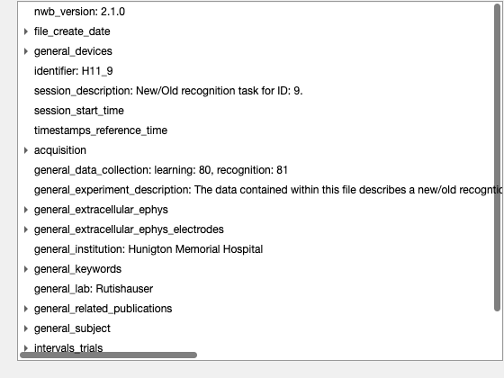
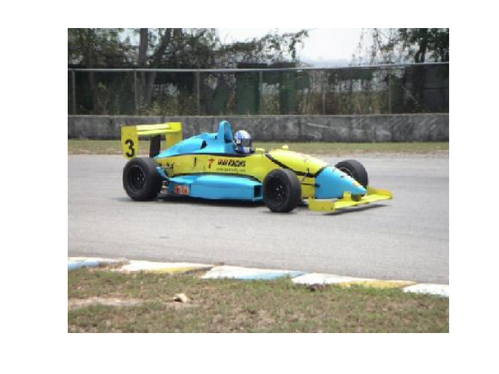
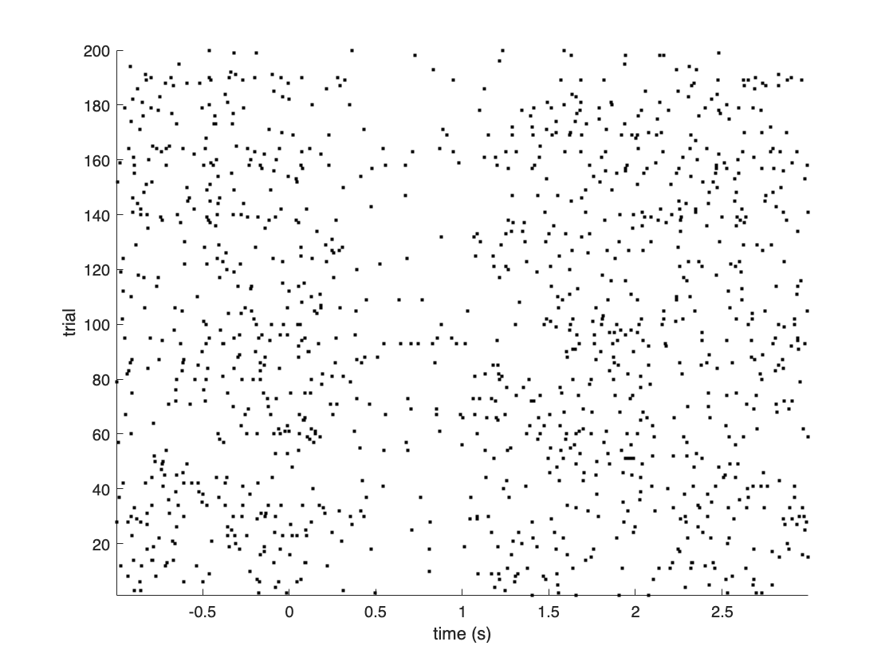
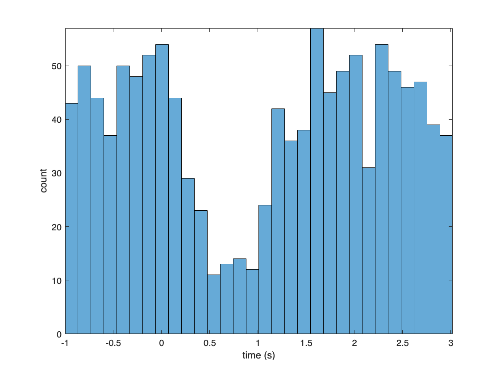

.. _read_demo-tutorial:

Reading NWB Files with MatNWB
=============================

.. image:: https://www.mathworks.com/images/responsive/global/open-in-matlab-online.svg
   :target: https://matlab.mathworks.com/open/github/v1?repo=NeurodataWithoutBorders/matnwb&file=tutorials/read_demo.mlx
   :alt: Open in MATLAB Online
.. image:: https://img.shields.io/badge/View-Rendered_Live_Script-blue
   :target: ../../_static/html/tutorials/read_demo.html
   :alt: View rendered Live Script

.. contents:: On this page
   :local:
   :depth: 2

Authors: Ryan Ly, with modification by Lawrence Niu

Last Updated: 2023-09-05

Introduction
------------

In this tutorial, we will read single neuron spiking data that is in the NWB standard format and do a basic visualization of the data. More thorough documentation regarding reading files as well as the ``NwbFile`` class, can be found in the `NWB Overview Documentation <https://nwb-overview.readthedocs.io/en/latest/file_read/file_read.html#reading-with-matnwb>`_

Download the data
-----------------

First, let's download an NWB data file from the `DANDI neurophysiology data archive <https://dandiarchive.org/>`_.

A NWB file represents a single session of an experiment. It contains all the data of that session and the metadata required to understand the data.

We will use data from one session of an experiment by `Chandravadia et al. (2020) <https://www.nature.com/articles/s41597-020-0415-9>`_, where the authors recorded single neuron electrophysiological activity from the medial temporal lobes of human subjects while they performed a visual recognition memory task.

1. Go to the DANDI page for this dataset: `https://dandiarchive.org/dandiset/000004/draft <https://dandiarchive.org/dandiset/000004/draft>`_
2. Toward the top middle of the page, click the "Files" button.

   .. image:: ../../_static/tutorials/media/read_demo/image_0.png
      :class: tutorial-media
      :width: 961px
      :alt: image_0.png
3. Click on the folder "sub-P11MHM" (click the folder name, not the checkbox).

   .. image:: ../../_static/tutorials/media/read_demo/image_1.png
      :class: tutorial-media
      :width: 960px
      :alt: image_1.png
4. Then click on the download symbol to the right of the filename "sub-P11HMH_ses-20061101_ecephys+image.nwb" to download the data file (69 MB) to your computer.

   .. image:: ../../_static/tutorials/media/read_demo/image_2.png
      :class: tutorial-media
      :width: 960px
      :alt: image_2.png

Installing matnwb
-----------------

Use the code below to install MatNWB from source using ``git``. Ensure ``git`` is on your path before running this line.

.. code-block:: matlab

   if ~exist('nwbRead', 'file') % Skip if MatNWB is on MATLAB's search path
       !git clone https://github.com/NeurodataWithoutBorders/matnwb.git
       % add the path to matnwb and generate the core classes
       addpath('matnwb');
   end

MatNWB works by automatically creating API classes based on the schema. For most NWB files, the classes are generated automatically by calling ``nwbRead`` farther down. This particular NWB file was created before this feature was supported, so we must ensure that these classes for the correct schema versions are properly generated before attempting to read from the file.

.. code-block:: matlab

   % Reminder: YOU DO NOT NORMALLY NEED TO CALL THIS FUNCTION. Only attempt this 
   % method if you encounter read errors.
   generateCore(util.getSchemaVersion('sub-P11HMH_ses-20061101_ecephys+image.nwb'));

Read the NWB file
-----------------

You can read any NWB file using ``nwbRead``. You will find that the print out for this shows a summary of the data within.

.. code-block:: matlab

   % ignorecache informs the `nwbRead` call to not generate files by default. Since 
   % we have already done this, we can skip this automated step when reading. If 
   % you are reading the file before generating, you can omit this argument flag.
   nwb = nwbRead('sub-P11HMH_ses-20061101_ecephys+image.nwb', 'ignorecache')

.. code-block:: text

   nwb = 
     NwbFile with properties:
   
                                   nwb_version: '2.1.0'
                              file_create_date: [1x1 types.untyped.DataStub]
                               general_devices: [1x1 types.untyped.Set]
                                    identifier: 'H11_9'
                           session_description: 'New/Old recognition task for ID: 9. '
                            session_start_time: 2006-11-01T00:00:00.000000-07:00
                     timestamps_reference_time: 2006-11-01T00:00:00.000000-07:00
                                   acquisition: [2x1 types.untyped.Set]
                                      analysis: [0x1 types.untyped.Set]
                                       general: [0x1 types.untyped.Set]
                       general_data_collection: 'learning: 80, recognition: 81'
                general_experiment_description: 'The data contained within this file describes a new/old recogntion task performed in patients with intractable epilepsy implanted with depth electrodes and Behnke-Fried microwires in the human Medical Temporal Lobe (MTL).'
                          general_experimenter: ''
                   general_extracellular_ephys: [9x1 types.untyped.Set]
        general_extracellular_ephys_electrodes: [1x1 types.core.DynamicTable]
                           general_institution: 'Hunigton Memorial Hospital'
                   general_intracellular_ephys: [0x1 types.untyped.Set]
         general_intracellular_ephys_filtering: ''
       general_intracellular_ephys_sweep_table: []
                              general_keywords: [1x1 types.untyped.DataStub]
                                   general_lab: 'Rutishauser'
                                 general_notes: ''
                          general_optogenetics: [0x1 types.untyped.Set]
                        general_optophysiology: [0x1 types.untyped.Set]
                          general_pharmacology: ''
                              general_protocol: ''
                  general_related_publications: [1x1 types.untyped.DataStub]
                            general_session_id: ''
                                general_slices: ''
                         general_source_script: ''
               general_source_script_file_name: ''
                              general_stimulus: ''
                               general_subject: [1x1 types.core.Subject]
                               general_surgery: ''
                                 general_virus: ''
                                     intervals: [0x1 types.untyped.Set]
                              intervals_epochs: []
                       intervals_invalid_times: []
                              intervals_trials: [1x1 types.core.TimeIntervals]
                                    processing: [0x1 types.untyped.Set]
                                       scratch: [0x1 types.untyped.Set]
                         stimulus_presentation: [1x1 types.untyped.Set]
                            stimulus_templates: [0x1 types.untyped.Set]
                                         units: [1x1 types.core.Units]

You can also use ``util.nwbTree`` to actively explore the NWB file.

.. code-block:: matlab

   util.nwbTree(nwb);

Stimulus
~~~~~~~~

Now lets take a look at the visual stimuli presented to the subject. They will be in ``nwb.stimulus_presentation``

.. code-block:: matlab

   nwb.stimulus_presentation

.. code-block:: text

   ans = 
     Set with properties:
   
       StimulusPresentation: [types.core.OpticalSeries]

This results shows us that ``nwb.stimulus_presentation`` is a ``Set`` object that contains a single data object called ``StimulusPresentation``, which is an ``OpticalSeries`` neurodata type. Use the ``get`` method to return this ``OpticalSeries``. ``Set`` objects store a collection of other NWB objects.

.. code-block:: matlab

   nwb.stimulus_presentation.get('StimulusPresentation')

.. code-block:: text

   ans = 
     OpticalSeries with properties:
   
                           distance: 0.7000
                      field_of_view: [1x1 types.untyped.DataStub]
                        orientation: 'lower left'
                          dimension: [1x1 types.untyped.DataStub]
                      external_file: ''
       external_file_starting_frame: []
                             format: 'raw'
                 starting_time_unit: 'seconds'
                timestamps_interval: 1
                    timestamps_unit: 'seconds'
                               data: [1x1 types.untyped.DataStub]
                          data_unit: 'meters'
                           comments: 'no comments'
                            control: []
                control_description: ''
                    data_conversion: 1
                    data_resolution: -1
                        description: 'no description'
                      starting_time: []
                 starting_time_rate: []
                         timestamps: [1x1 types.untyped.DataStub]

``OpticalSeries`` is a neurodata type that stores information about visual stimuli presented to subjects. This print out shows all of the attributes in the ``OpticalSeries`` object named ``StimulusPresentation``. The images are stored in ``StimulusPresentation.data``

.. code-block:: matlab

   StimulusImageData = nwb.stimulus_presentation.get('StimulusPresentation').data

.. code-block:: text

   StimulusImageData = 
     DataStub with properties:
   
       filename: 'sub-P11HMH_ses-20061101_ecephys+image.nwb'
           path: '/stimulus/presentation/StimulusPresentation/data'
           dims: [3 300 400 200]
          ndims: 4
       dataType: 'uint8'

When calling a data object directly, the data is not read but instead a ``DataStub`` is returned. This is because data is read "lazily" in MatNWB. Instead of reading the entire dataset into memory, this provides a "window" into the data stored on disk that allows you to read only a section of the data. In this case, the last dimension indexes over images. You can index into any ``DataStub`` as you would any MATLAB matrix.

.. code-block:: matlab

   % get the image and display it
   % the dimension order is provided as follows:
   % [rgb, y, x, image index]
   img = StimulusImageData(1:3, 1:300, 1:400, 32);

A bit of manipulation allows us to display the image using MATLAB's ``imshow``.

.. code-block:: matlab

   img = permute(img,[3, 2, 1]);  % fix orientation
   img = flip(img, 3); % reverse color order
   F = figure();
   imshow(img, 'InitialMagnification', 'fit');
   daspect([3, 5, 5]);

To read an entire dataset, use the ``DataStub.load`` method without any input arguments. We will use this approach to read all of the image display timestamps into memory.

.. code-block:: matlab

   stimulus_times = nwb.stimulus_presentation.get('StimulusPresentation').timestamps.load();

Quick PSTH and raster
---------------------

Here, I will pull out spike times of a particular unit, align them to the image display times, and finally display the results.

First, let us show the first row of the NWB Units table representing the first unit.

.. code-block:: matlab

   nwb.units.getRow(1)

.. list-table::
   :header-rows: 1

   * - 
     - origClusterID
     - waveform_mean_encoding
     - waveform_mean_recognition
     - IsolationDist
     - SNR
     - waveform_mean_sampling_rate
     - spike_times
     - electrodes
   * - 1
     - 1102
     - 256x1 double
     - 256x1 double
     - 11.2917
     - 1.4407
     - 98400
     - 373x1 double
     - 0

Let us specify some parameters for creating a cell array of spike times aligned to each stimulus time.

.. code-block:: matlab

   %% Align spikes by stimulus presentations
   
   unit_ind =8;
   before =1;
   after =3;

``getRow`` provides a convenient method for reading this data out.

.. code-block:: matlab

   unit_spikes = nwb.units.getRow(unit_ind, 'columns', {'spike_times'}).spike_times{1}

.. code-block:: text

   unit_spikes = 2116x1
   1.0e+03 *
   
       5.9338
       5.9343
       5.9346
       5.9358
       5.9364
       5.9375
       6.0772
       6.0776
       6.0797
       6.0798

Spike times from this unit are aligned to each stimulus time and compiled in a cell array

.. code-block:: matlab

   results = cell(1, length(stimulus_times));
   for itime = 1:length(stimulus_times)
       stimulus_time = stimulus_times(itime);
       spikes = unit_spikes - stimulus_time;
       spikes = spikes(spikes > -before);
       spikes = spikes(spikes < after);
       results{itime} = spikes;
   end

Plot results
------------

Finally, here is a (slightly sloppy) peri-stimulus time histogram

.. code-block:: matlab

   figure();
   hold on
   for i = 1:length(results)
       spikes = results{i};
       yy = ones(length(spikes)) * i;
   
       plot(spikes, yy, 'k.');
   end
   hold off
   ylabel('trial');
   xlabel('time (s)');
   axis('tight')

.. code-block:: matlab

   figure();
   all_spikes = cat(1, results{:});
   histogram(all_spikes, 30);
   ylabel('count')
   xlabel('time (s)');
   axis('tight')

Conclusion
----------

This is an example of how to get started with understanding and analyzing public NWB datasets. This particular dataset was published with an extensive open analysis conducted in both MATLAB and Python, which you can find `here <https://github.com/rutishauserlab/recogmem-release-NWB>`_. For more datasets, or to publish your own NWB data for free, check out the DANDI archive `here <http://dandiarchive.org/>`_. Also, make sure to check out the DANDI breakout session later in this event.
