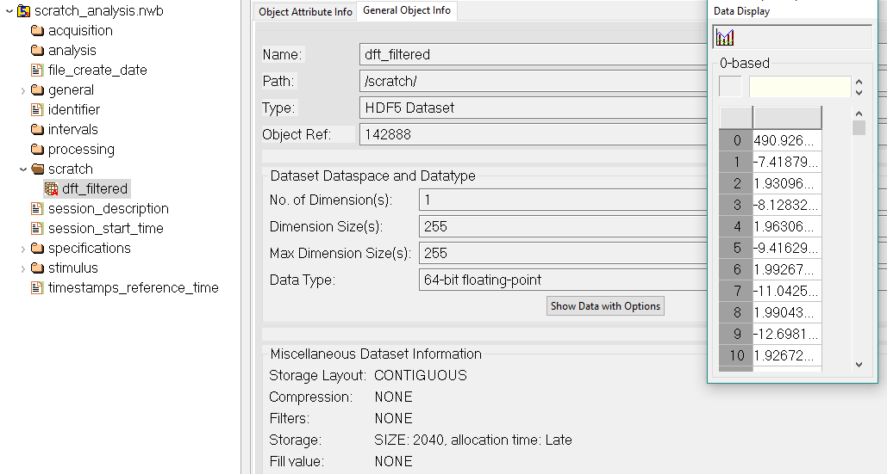

.. _scratch-tutorial:

Working with Scratch Space in MatNWB
====================================

.. image:: https://www.mathworks.com/images/responsive/global/open-in-matlab-online.svg
   :target: https://matlab.mathworks.com/open/github/v1?repo=NeurodataWithoutBorders/matnwb&file=tutorials/scratch.mlx
   :alt: Open in MATLAB Online
.. image:: https://img.shields.io/badge/View-Rendered_Live_Script-blue
   :target: ../../_static/html/tutorials/scratch.html
   :alt: View rendered Live Script

.. contents:: On this page
   :local:
   :depth: 2

This tutorial will focus on the basics of working with a `NWBFile <https://matnwb.readthedocs.io/en/latest/pages/neurodata_types/core/NWBFile.html>`_ for storing non-standardizable data. For example, you may want to store results from one-off analyses of some temporary utility. NWB provides in-file  **scratch space** as a dedicated location where miscellaneous non-standard data may be written.

Setup
-----

Let us first set up an environment with some "acquired data".

.. code-block:: matlab

   ContextFile = NwbFile(...
       'session_description', 'demonstrate NWBFile scratch', ... % required
       'identifier', 'SCRATCH-0', ...  % required
       'session_start_time', datetime(2019, 4, 3, 11, 0, 0, 'TimeZone', 'local'), ... % required
       'file_create_date', datetime(2019, 4, 15, 12, 0, 0, 'TimeZone', 'local'), ... % optional
       'general_experimenter', 'Niu, Lawrence', ...
       'general_institution', 'NWB' ...
   );
   
   % Simulate some data
   timestamps = 0:100:1024;
   data = sin(0.333 .* timestamps) ...
       + cos(0.1 .* timestamps) ...
       + randn(1, length(timestamps));
   RawTs = types.core.TimeSeries(...
       'data', data, ...
       'data_unit', 'm', ...
       'starting_time', 0., ...
       'starting_time_rate', 100, ...
       'description', 'simulated acquired data' ...
   );
   ContextFile.acquisition.set('raw_timeseries', RawTs);
   
   % "Analyze" the simulated data
   
   % We provide a re-implementation of scipy.signal.correlate(..., mode='same')
   % Ideally, you should use MATLAB-native code though using its equivalent 
   % function (xcorr) requires the Signal Processing Toolbox
   correlatedData = sameCorr(RawTs.data, ones(128, 1)) ./ 128;
   
   % If you are unsure of how HDF5 paths map to MatNWB property structures, we 
   % suggest using HDFView to verify. In most cases, MatNWB properties map 
   % directly to HDF5 paths.
   FilteredTs = types.core.TimeSeries( ...
       'data', correlatedData, ...
       'data_unit', 'm', ...
       'starting_time', 0, ...
       'starting_time_rate', 100, ...
       'description', 'cross-correlated data' ...
   )

.. code-block:: text

   FilteredTs = 
     TimeSeries with properties:
   
        starting_time_unit: 'seconds'
       timestamps_interval: 1
           timestamps_unit: 'seconds'
                      data: [-4.7892e-04 -4.7892e-04 -4.7892e-04 -4.7892e-04 -4.7892e-04 -4.7892e-04 -4.7892e-04 -4.7892e-04 -4.7892e-04 -4.7892e-04 -4.7892e-04]
                 data_unit: 'm'
                  comments: 'no comments'
                   control: []
       control_description: ''
           data_continuity: ''
           data_conversion: 1
               data_offset: 0
           data_resolution: -1
               description: 'cross-correlated data'
             starting_time: 0
        starting_time_rate: 100
                timestamps: []

.. code-block:: matlab

   ProcModule = types.core.ProcessingModule( ...
       'description', 'a module to store filtering results', ...
       'filtered_timeseries', FilteredTs ...
   );
   ContextFile.processing.set('core', ProcModule);
   nwbExport(ContextFile, 'context_file.nwb');

Warning Regarding the Usage of Scratch Space
--------------------------------------------

**Scratch data written into the scratch space should not be intended for reuse or sharing. Standard NWB types, along with any extensions, should always be used for any data intended to be shared. Published data should not include scratch data and any reuse should not require scratch data for data processing.**

Writing Data to Scratch Space
-----------------------------

Let us first copy what we need from the processed data file.

.. code-block:: matlab

   ScratchFile = NwbFile('identifier', 'SCRATCH-1');
   ContextFile = nwbRead('./context_file.nwb', 'ignorecache');
   % again, copy the required metadata from the processed file.
   ScratchFile.session_description = ContextFile.session_description;
   ScratchFile.session_start_time = ContextFile.session_start_time;

We can now do an analysis lacking specification but that we still wish to store results for.

.. code-block:: matlab

   % ProcessingModule stores its timeseries inside of the "nwbdatainterface" property which is a 
   % Set of NWBDataInterface objects. This is not directly mapped to the NWB file but is used to 
   % distinguish it and DynamicTable objects which it stores under the "dynamictable" property.
   FilteredTs = ContextFile.processing.get('core').nwbdatainterface.get('filtered_timeseries');
   % note: MatNWB does not currently support complex numbers. If you wish to store the data, consider
   % storing each number as a struct which will write the data to HDF5 using compound types.
   dataFft = real(fft(FilteredTs.data.load()));
   ScratchData = types.core.ScratchData( ...
       'data', dataFft, ...
       'notes', 'discrete Fourier transform from filtered data' ...
   )

.. code-block:: text

   ScratchData = 
     ScratchData with properties:
   
       notes: 'discrete Fourier transform from filtered data'
        data: [11x1 double]

.. code-block:: matlab

   ScratchFile.scratch.set('dft_filtered', ScratchData);
   nwbExport(ScratchFile, 'scratch_analysis.nwb');

The ``scratch_analysis.nwb`` file will now have scratch data stored in it:

.. code-block:: matlab

   function C = sameCorr(A, B)
       % SAMECORR scipy.signals.correlate(..., mode="same") equivalent
       for iDim = 1:ndims(B)
           B = flip(B, iDim);
       end
       C = conv(A, conj(B), 'same');
   end
